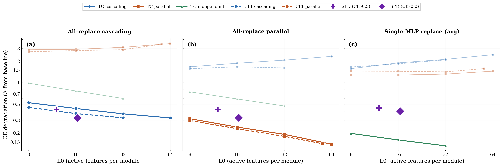

# Experiment 021: E2E Evaluation on Jose's Target Model

## Overview

This experiment evaluates end-to-end (e2e) trained transcoders and cross-layer transcoders (CLTs) on jose's target model (`t-9d2b8f02`), a 4-layer LlamaSimpleMLP transformer (768-dim, 3072-dim MLP, GELU activations). We compare them against jose's SPD decomposition (`s-55ea3f9b`).

All models were trained on the Pile dataset with 500M tokens. The baseline cross-entropy (CE) of the target model is **2.91**.

## Model Architectures

**Transcoders (TC)** are per-layer models that map MLP input → MLP output. Each layer has its own encoder/decoder pair with batch top-k sparsity. At inference, a transcoder replaces one MLP by encoding the MLP's input into sparse features and decoding back to the MLP's output space.

**Cross-Layer Transcoders (CLT)** have per-layer encoders but a triangular decoder structure: features activated at source layer *i* write to MLP outputs at layers *i* through *n−1*. This allows a single feature to represent a computation that spans multiple layers.

**SPD (Stochastic Parameter Decomposition)** decomposes the model's weight matrices into components with learned causal importance (CI) masks. At inference, components with CI below a threshold are zeroed out. SPD decomposes all model parameters (MLP + attention), not just MLPs.

## Training Strategies

All models are trained e2e: the training loss is the KL divergence between the original model's logits and the logits produced when MLPs are replaced by the sparse reconstruction.

### TC/CLT Training Modes

| Mode | Description |
|------|-------------|
| **Cascading** | All 4 MLPs are replaced simultaneously. Each layer's encoder sees the *modified* residual stream (i.e., the output of the previous layer's transcoder feeds into the next layer's encoder). The KL loss is computed once on the final logits. |
| **Parallel** | All 4 MLPs are replaced simultaneously. Each layer's encoder sees the *original/clean* residual stream (pre-computed before any replacements). The KL loss is computed once on the final logits. |
| **Independent** (TC only) | Each layer's transcoder is trained with its own per-layer KL loss. Layer *i*'s loss measures the KL divergence when only MLP *i* is replaced. Losses are summed and a single backward pass updates all 4 transcoders jointly. |

### Sparsity

All TC/CLT models use **batch top-k** activation: the top-k features across the entire batch are kept active, the rest are zeroed. We sweep k ∈ {8, 16, 32, 64}, corresponding to L0 ≈ k active features per module.

For SPD, sparsity is controlled by thresholding the causal importance (CI) values. We evaluate at two thresholds: CI > 0.5 and CI > 0.0.

## Evaluation Strategies

We evaluate every model in three settings that test different aspects of reconstruction quality:

### 1. All-Replace Cascading

All 4 MLPs are replaced simultaneously. Each layer's encoder receives the **modified** residual stream — i.e., layer 2's encoder sees the residual stream that includes the reconstruction from layers 0 and 1, not the original MLP outputs.

This tests whether the model can reconstruct faithfully when errors compound across layers. Models trained in cascading mode are optimized for this setting.

### 2. All-Replace Parallel

All 4 MLPs are replaced simultaneously. Each layer's encoder receives the **clean/original** residual stream (pre-computed from the unmodified model before any replacements are applied).

This tests reconstruction quality when each layer operates independently on clean inputs. Models trained in parallel mode are optimized for this setting.

### 3. Single-MLP Replace (Average)

Only **one** MLP is replaced at a time; the other 3 run normally. We evaluate this for each of the 4 layers and report the average CE.

This tests how well each individual layer reconstructs in isolation, without interference from other replaced layers. Models trained in independent mode are optimized for this setting.

## L0 Metric

**L0** measures the average number of active (non-zero) features per module. For transcoders and CLTs, this equals the top-k value (since batch top-k keeps exactly k features active on average). For SPD, L0 is the average number of components with CI above the threshold, averaged across all MLP weight matrices.

A lower L0 means sparser, more interpretable features. The x-axis of the plot shows L0, so curves further left achieve the same CE degradation with fewer active features.

## Results



### Key Findings

**Models perform best in their matched eval mode.** Each training strategy optimizes for a specific interaction pattern between layers, and models degrade substantially when evaluated in a mismatched mode:

- **Cascading-trained models** (TC cascading, CLT cascading) achieve the lowest CE degradation in the cascading eval (panel a, Δ ≈ 0.32–0.53) but perform poorly in parallel eval (panel b, Δ ≈ 1.6–2.3).
- **Parallel-trained models** (TC parallel, CLT parallel) achieve the lowest CE degradation in parallel eval (panel b, Δ ≈ 0.14–0.32) but perform poorly in cascading eval (panel a, Δ ≈ 2.7–3.5).
- **Independent-trained TCs** perform best in single-MLP eval (panel c, Δ ≈ 0.13–0.20) and are competitive across all three eval modes.

**TC independent is the most robust.** Despite being trained per-layer, independent TCs achieve reasonable performance in all three eval settings and dominate the single-MLP eval.

**CLTs match TCs at each sparsity level.** CLT cascading ≈ TC cascading and CLT parallel ≈ TC parallel, suggesting the triangular decoder structure doesn't provide a clear advantage in this setting.

**SPD is competitive at moderate sparsity.** Jose's SPD (CI > 0.0, L0 ≈ 16) achieves Δ ≈ 0.32 in parallel eval — comparable to TC/CLT parallel at k=8. In single-MLP eval, SPD achieves Δ ≈ 0.40, between the parallel/cascading models and the independent TCs.

### Results Table

| Model | k | L0 | Cascading Δ | Parallel Δ | Single Δ |
|-------|---:|----:|-----------:|-----------:|---------:|
| TC cascading | 8 | 8.0 | **0.53** | 1.67 | 1.57 |
| TC cascading | 16 | 16.0 | **0.44** | 1.87 | 1.89 |
| TC cascading | 32 | 32.0 | **0.37** | 2.06 | 2.11 |
| TC cascading | 64 | 64.0 | **0.32** | 2.33 | 2.45 |
| TC parallel | 8 | 8.0 | 2.87 | **0.32** | 1.28 |
| TC parallel | 16 | 16.0 | 2.91 | **0.24** | 1.28 |
| TC parallel | 32 | 32.0 | 3.11 | **0.19** | 1.32 |
| TC parallel | 64 | 63.9 | 3.50 | **0.14** | 1.45 |
| TC independent | 8 | 8.0 | 0.98 | 0.75 | **0.20** |
| TC independent | 16 | 16.0 | 0.77 | 0.59 | **0.16** |
| TC independent | 32 | 32.0 | 0.60 | 0.47 | **0.13** |
| CLT cascading | 8 | 8.0 | **0.45** | 1.57 | 1.65 |
| CLT cascading | 16 | 16.0 | **0.37** | 1.67 | 1.83 |
| CLT cascading | 32 | 32.0 | **0.32** | 1.60 | 2.08 |
| CLT parallel | 8 | 8.0 | 2.69 | **0.30** | 1.45 |
| CLT parallel | 16 | 16.0 | 2.80 | **0.23** | 1.44 |
| CLT parallel | 32 | 32.0 | 2.88 | **0.18** | 1.42 |
| CLT parallel | 64 | 56.2 | 3.43 | **0.14** | 1.57 |
| Jose SPD (CI>0.5) | — | 12.0 | — | 0.42 | 0.45 |
| Jose SPD (CI>0.0) | — | 16.4 | — | 0.32 | 0.40 |

Bold values indicate the matched eval mode for each training strategy. Δ = CE degradation from baseline (2.91).

## Reproduction

```bash
# Download checkpoints and evaluate
python experiments/exp_021_eval_e2e_jose/eval_e2e_jose.py

# Generate plot
python experiments/exp_021_eval_e2e_jose/plot_e2e_jose.py
```

## Note on SPD Code Version

The jose SPD model was trained with SPD commit `85c6b702`. The CI function (`GlobalSharedTransformerCiFn`) applied `F.rms_norm` to inputs at that commit; this was later removed on HEAD. To get correct CI values, the SPD repo must be checked out to that commit.
