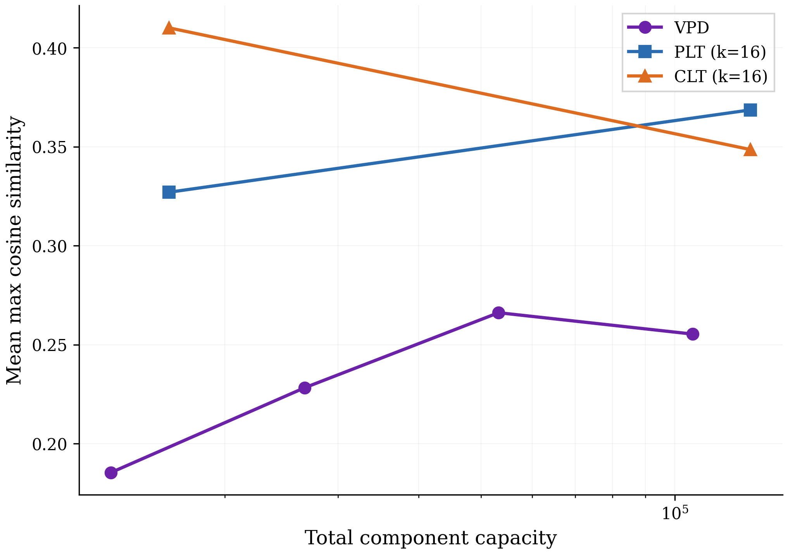
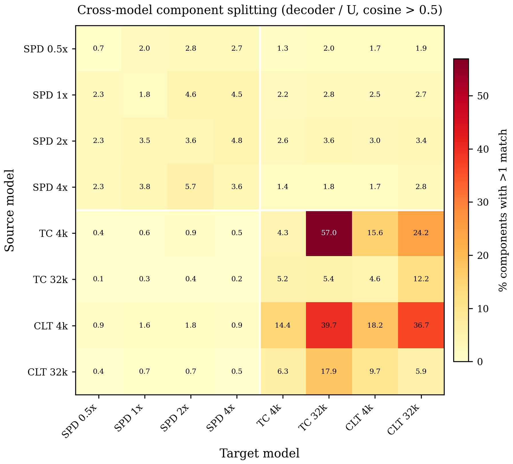

## Introduction

<!-- Language models' trainable parameters, in interaction with their architecture and dataset, are responsible for their remarkable intelligence. Through training, their parameters learn to implement neural algorithms that we do not know how to design directly. -->

Language models are remarkably intelligent. During training, their parameters learn to implement neural algorithms that we do not know how to design directly.

We can thus train machines to solve tasks that otherwise resist engineering solutions, incidentally creating objects that are of great scientific interest in their own right. However, since we did not design these neural algorithms ourselves, it means that an increasing portion of our daily lives depend on increasingly capable systems that we do not deeply understand.

Mechanistic interpretability aims to reverse engineer neural networks so that we can understand networks such as language models. But reverse engineering requires decomposing a system into simpler parts that we can study in relative isolation. A key barrier to reverse engineering neural networks is that it is not obvious how best to decompose them into such parts. Unfortunately, the most obvious choices of these parts—such as neurons, attention heads, or whole layers—often don't map to individual, interpretable computations.

Alternative approaches to decomposition, such as per-layer transcoders or cross-layer transcoders (CLTs), involve fitting a set of simple functions to the transitions between activations at different layers in the network, and linearly combining the outputs of these simple functions. The idea is to approximate the complex, nonlinear function implemented by the network's layers using a simpler, easier-to-understand function. These *activation-based decomposition* methods have led to significant advances in our understanding of the intermediate representations inside neural networks when computing their outputs.
<!--  or mixtures of linear transforms (MOLTs)  -->

But identifying representations is not the same as understanding the computations that use those representations as their inputs and outputs. Unfortunately, because the simpler functions that these methods use are of a different functional form to the original network, it is hard to relate their accounts of network function to the actual objects that are doing the computations — the network's parameters and its nonlinearities. This is not just a theoretical issue; it prevents us from achieving practical engineering goals. For example, it makes it challenging to know how to make edits to a model's parameters that change its neural algorithm in a predictable, desirable way (while also avoiding unpredictable side effects). It also makes it hard to predict how the model's neural algorithm will perform on a different distribution than the one on which it was studied. This mismatch of functional form between models and their activation-based decompositions is an important issue, but it is not the only one: Activation-based methods have not yet yielded decompositions that exhibit a fully satisfactory level of mechanistic faithfulness, and suffer from a number of other issues.

These issues motivate alternative approaches to mechanistic decomposition, including *parameter decomposition methods*, which give accounts of network function in terms of *parameter components* that the network uses on each datapoint. *Ablation-based parameter decomposition methods* identify a set of parameter components where as few components as possible are "necessary" to perform the same computations as the original network on any datapoint, where "necessary" means that they cannot be ablated (including, crucially, partial ablations) on a given datapoint without adversely affecting output reconstruction error. Simultaneously, the parameter components are selected to implement as simple computations as possible and to sum collectively to the target network's parameters. If parameter components exhibit all these properties, then they are strong candidates for the network's "ground truth mechanisms" (though one would first need to accept philosophically that such mechanisms can be said to exist in networks trained on real data!).

Parameter decomposition methods can identify known ground truth mechanisms in toy models that: are not aligned to neurons, individual attention heads, or layers; operate on representations in superposition; or are multidimensional. And, due to the requirement that components sum to the target model, parameter decomposition methods do not exhibit feature splitting. Notably, parameter decomposition methods are also architecture-agnostic and can readily be applied to any architecture, unlike activation-based methods, where it has been challenging to use the same decomposition methods to decompose both attention layers and MLPs. In demonstration of this ability, previous work has used ablation-based parameter decomposition to identify induction heads in a transformer trained on a toy model of induction.

Ablation-based parameter decomposition methods thus promise solutions to many of the issues of activation-based decomposition methods. However, prior parameter decomposition proposals have several important shortcomings:

- **No application to full language models.** While the most recent parameter decomposition method, Stochastic Parameter Decomposition (SPD), is more scalable than its predecessor (Attribution-based Parameter Decomposition), it has not yet been applied to full language models.
- **No demonstration of robustness to adversarial ablations.** While some work has applied SPD to a single layer of GPT2-small, no application of SPD so far has measured key metrics that would be necessary to ensure mechanistic faithfulness, such as output reconstruction under adversarial ablations (rather than only stochastic ablations).
- **Partial incompleteness: No clustering from subcomponents to components.** Previous implementations of SPD have been partially incomplete: Attribution-based parameter decomposition decomposed networks into full vectors in parameter space, which span all parameters in the model. But SPD decomposes them into rank-one matrices, which are limited only to single parameter matrices. A full implementation of SPD requires a *post hoc* clustering step to combine multiple rank-one matrices into full vectors in parameter space, but previous work left this clustering step implicit.
- **No analysis of nonlinear interactions between components.** Previous work omitted analyses of the nonlinear interactions between parameter components, which would be crucial for assessing how useful parameter decomposition methods are for interpretability.

In this work, we resolve all of these issues and introduce a method called ad**V**ersarial **P**arameter **D**ecomposition (**VPD**).

VPD builds heavily on the SPD method but has several important modifications, which together make it more mechanistically faithful and scalable to larger models than decomposed in previous work. The primary difference between VPD and SPD is the way ablations are done. On each datapoint, both SPD and VPD sample from the space of possible partial ablations of parameter components in order to check whether those parameter components can be partially ablated in any combination, thus identifying whether they are "necessary" for that datapoint. But SPD samples from the space of partial ablations using *stochastic* samples from the space, whereas VPD uses *adversarially chosen samples*. Both approaches are nonetheless designed to approximate what would happen if we could check *all* potential partial ablations.

Here, we use VPD to decompose a small language model (67M parameters) trained on The Pile. We find parameter components that are highly interpretable, both in terms of the dataset examples that they activate on and how they interact with other components to produce specific behaviors. We compare the parameter components that we find to the objects found by other decomposition methods, such as sparse autoencoder (SAE) latents and cross-layer transcoder (CLT) latents and find that they explain more of the target model's performance using an equivalent number of active components; exhibit less feature splitting; have comparable or greater interpretability; and are more mechanistically faithful. We develop attribution graphs that let us study the circuits that underlie some language model behaviors. Furthermore, we analyze the nonlinear interactions between parameter components. We demonstrate that complex nonlinear interactions are rarer than would be expected by chance, despite not being a property our method optimizes for directly, suggesting that it reflects an underlying computational simplicity in the target model itself. Finally, we demonstrate that our method identifies network components that [TODO: have better practical utility than alternative methods, such as "are better for steering according to benchmarks", "can be used to remove memorized datapoints", and "even permit direct editing of the model parameters in interpretable ways"].

## The core method: Adversarial Parameter Decomposition

Our method, VPD, builds heavily on SPD. Our explanation of VPD does not assume familiarity with SPD or its predecessor. In this section, we introduce ablation-based parameter decomposition methods from scratch and highlight key differences between VPD and prior methods in this class.

Our goal is to decompose a neural network into the *mechanisms* that it uses to compute its behavior — the things that it uses to take input activations, compute its hidden activations, and finally compute its output. We don't approach this goal with strong presuppositions of what a "mechanism" is. But we take for granted that a typical network doesn't use all of its mechanisms on every input (or, at least, it doesn't use all of its mechanisms by the same amount). If that were not the case, then networks could not be said to be *modular*, having distinct parts that do different things on different inputs. Without modularity, networks simply couldn't be decomposed into distinct functional units.

One candidate here for the network's mechanisms is the network's parameters. Like mechanisms, networks appear not to use all of their parameters simultaneously on every datapoint. This happens, for instance, when a network's parameters "read from" activation subspaces that are orthogonal to the activations on that datapoint, thus projecting the activations to zero, thereafter having no downstream causal effect. Alternatively, if the activations fail to "activate" a given ReLU neuron, the activation of that neuron is zero, thereafter having no downstream causal effect. However, the network's parameters are in fact a single vector in the network's parameter space, and do not have an obvious decomposition into parts. How should they be decomposed into parts that comprise the network's mechanisms?

On a high level, parameter decomposition methods use the idea that it should be possible, for a given datapoint, to identify the "subset" of the network's parameters that are necessary and sufficient for computing its output on that datapoint. That subset of parameters should contain all the mechanisms used by the network on that datapoint. If particular subsets of the network's parameters are repeatedly used together by different datapoints, then they may be part of the same mechanism. Parameter decomposition methods therefore aim to find particular subsets of the network's parameters that tend to be used together, where as few of them as possible are necessary and sufficient for computing the network's output on any input.

More concretely: If particular parameters are unused by the network on a particular datapoint, then we should be able to ablate them (including partially) on that datapoint without adversely affecting the network's output. Ablation-based parameter decomposition methods thus aim to decompose network parameters into a set of vectors in parameter space called *parameter components*, which are trained to exhibit a number of specific properties such that, if parameter components exhibit those properties, they would be good candidates for the network's "mechanisms". They are trained such that they are:

- **Parameter-faithful**: They sum to the network's total parameter vector.
- **Minimal**: As few components as possible are causally important for computing the network's output on any particular input.
- **Mechanistically faithful**: Every subset of components that includes the causally important components is sufficient to compute the network's output.
- **Simple**: Components should each involve as little computational machinery as possible.

In the following sections, we define parameter components concretely and define how they are optimized to exhibit each of these four properties.

### Parameter components are vectors in parameter space and consist of subcomponents

Suppose we have a neural network $f(x;\theta)$ with parameters $\theta$. We would like to decompose this parameter vector into a sum of *parameter components* $\theta = \sum_i \theta_i$ with the above properties.

It would be computationally expensive to decompose models into whole parameter vectors, since each such vector would have a memory cost equivalent to the whole target model. Therefore, as in SPD, we use a less expensive way to parameterize parameter components. Although its parameters $\theta$ can be expressed as a single large vector, they are more commonly conceptualized as a set of matrices $\theta = \{W_1, \dots, W_L\}$. We further decompose individual matrices into sums of rank-one matrices called *subcomponents*, each parameterized as an outer product of two vectors: $W_l \approx \sum_{c} \vec{U^l_c} \vec{V_c^{l \top}} = U_l V_l^\top$, where there may be more subcomponents than rows and columns in the matrix. Although a single subcomponent explicitly parameterizes only a single weight matrix, it implicitly parameterizes a full parameter vector if we assume it takes values of $0$ in every other weight matrix. It is therefore possible to combine these subcomponents into full parameter components by adding them together in the right way. We identify these components using a subcomponent clustering method. Previous work left this clustering step implicit, but in this paper we introduce an explicit method.

<figure class="full-bleed">

<figcaption>Diagram showing how parameter components sum to the original weight matrices. [TODO: Caption]</figcaption>
</figure>

### Enforcing parameter faithfulness with a Delta-component

To ensure the components collectively sum to the parameter vector of the target model, we define additional Delta-components $\Delta^l$ that parameterize the difference between our subcomponents and the original model's matrices:

$$\Delta^l_{i,j} := W^l_{i,j} - \sum^C_{c=1} U^l_{i,c} V^l_{c,j}$$

Additionally, we encourage Delta-components to be approximately zero with an auxiliary MSE loss between the sum of the parameter subcomponents and each target model matrix.

### Optimizing for minimality

For minimality, we want as few components as possible to be causally important for computing the network's output on any particular input. We therefore need some way to estimate which parameter components are "required" for computing the network's output on a given datapoint. We also require a notion of how well the "required" subcomponents have reconstructed the network's output.

Ablation-based parameter decomposition methods contend that a parameter component is "required" if it cannot be ablated without affecting the model's output on that datapoint. As in SPD, we train a *causal importance function* $\Gamma: X \rightarrow [0,1]^{C \times L}$ to predict how ablatable each subcomponent is on a given datapoint. Like SPD, we implement $\Gamma$ as a neural network, though we use a different architecture.

We want our causal importance function to output *causal importance values* $g^l_c(x,t) \in [0,1]$ for each subcomponent $(c)$ of weight matrix $l$ on a given datapoint $x$ at sequence position $t$. If $g^l_c(x,t) = 0$, then that subcomponent should be fully or partially ablatable without affecting the output. If $g^l_c(x,t) = 1$, then it should not be possible to ablate that component without affecting the model's output on that datapoint.

We also want our causal importance values to predict the maximal extent of the ablatability of each subcomponent. Otherwise, the causal importance function could output a value of $1$ for every subcomponent on every input. We must therefore train the causal importance values $g^l_c(x,t)$ to take minimal values.

Together, this leads to our *importance minimality loss*:

$$\mathcal{L}_{\text{importance-minimality}} = \sum_{x,t}\sum^L_{l=1}\sum^C_{c=1} | g^l_c(x,t) |^p$$

where $p > 0$. The Delta-components $\Delta^l$ are defined always to have causal importance values of zero, since they should never be required to compute the model output.

### Optimizing for mechanistic faithfulness

#### Mechanistic faithfulness implies the ability to aggregate local explanations into global ones

Parameter decomposition methods aim to identify the simplest, fewest parameter components that are "causally important" on a datapoint. This is quite a bold aim, since actually achieving this goal means accurately describing the network's causal structure in the simplest possible terms. Implicitly, this is a claim about mechanistic faithfulness, since it would be impossible to accurately describe the network's causal structure without it. This means it is quite important to get our definition of "causal importance" right, because it bears directly on our claims of mechanistic faithfulness. Earlier, we said a parameter component is considered "causally important" on a datapoint if it cannot be ablated without affecting the model's output. But what should this mean exactly?

Thinking about an edge case will help us understand how we should define this: Suppose two components $\theta_A, \theta_B$ can be *jointly* ablated, but not *individually* ablated, on a data point $x_1$ without affecting the output. This could happen if $\theta_A$ and $\theta_B$ cancel each other out by influencing the final model output vector in opposite directions. Should these two jointly ablatable parameter components be considered ablatable on datapoint $x_1$?

For our purposes: No. It is not enough for the parameter components to be ablatable jointly. We also require them to be ablatable individually and for all other possible combinations of ablations of other components. This stricter requirement is important for mechanistic faithfulness. Suppose the action of $\theta_A$ is to add a vector $v$ to the residual stream and the action of $\theta_B$ is to add $-v$ in a later layer. They may be jointly ablatable, but removing them would be mechanistically unfaithful to how the network actually computed its output!

This stricter requirement is also crucial for the goals of mechanistic interpretability in another sense: It ensures that *local explanations* of the model's behavior on single data points (or small subsets of the dataset) involving subsets of parameter components can aggregate into more *global explanations* of the network's behavior over larger subsets of the data in the way we expect. To understand why local-to-global aggregation of explanations only works under this stricter requirement, let's continue the example:

Suppose we explain the network's behavior on a data point $x_1$ using some subset of parameter components $S_1$. And imagine, since $\theta_A$ and $\theta_B$ are jointly ablatable, that we (wrongly) decide they aren't causally important on $x_1$, and therefore both $\theta_A, \theta_B \notin S_1$. Now suppose we later explain the network's behavior on some other data point $x_2$, using some other subset of parameter components $S_2$. But on this datapoint, it happens to be the case that $\theta_A \in S_2$ but $\theta_B \notin S_2$.

It should be the case that the network parameterized by the union $S_1 \cup S_2$ produces the same behavior on $x_1$ and $x_2$ as each of those subsets on their respective datapoint. In other words, it should be the case that

$$f(x_1, \sum_{\in S_1} \theta_i) \approx f(x_1, \sum_{\in S_1 \cup S_2} \theta_i) \quad\text{ AND }\quad f(x_2, \sum_{\in S_2} \theta_i) \approx f(x_2, \sum_{\in S_1 \cup S_2} \theta_i)$$

This is because $S_1$ should contain all the parameter components that are causally important on $x_1$, and $S_2$ should contain all the parameter components that are causally important on $x_2$. So their union should behave similarly on their respective datapoints. But because we (wrongly) decided earlier that $\theta_A, \theta_B \notin S_1$ because they were jointly ablatable, now only $\theta_A \in S_1 \cup S_2$. Unfortunately $\theta_B \notin S_1 \cup S_2$. This means that in $S_1 \cup S_2$ there is no $\theta_B$ to cancel the effects of $\theta_A$. So

$$f(x_1, \sum_{\in S_1} \theta_i) \not\approx f(x_1, \sum_{\in S_1 \cup S_2} \theta_i)$$

This is an undesirable outcome that results from how we defined what it meant for $\theta_A$ and $\theta_B$ to be causally important! We therefore conclude that $\theta_A$ and $\theta_B$ should both be considered causally important on $x_1$, even though their effects cancel on that datapoint.

This example is an illustration of a more general requirement: We want the union of $S_1$ with *any* other subset of parameter components to produce approximately the same output as the target model on data point $x_1$. This way, we can be sure that our local explanation did not miss any computationally relevant behavior that would cause it to not aggregate with other local explanations in the way we expect. This property is central to our definition of "mechanistic faithfulness" and an important consequence of our definition of "causal importance".

#### Optimizing for mechanistic faithfulness: Setup

Ablation-based parameter decomposition methods, at their core, instantiate this definition of mechanistic faithfulness by estimating how ablatable each parameter component is (by using causal importance functions) on a given datapoint, then actually doing a (full or partial) ablation and training the ablated parameters to approximate the same output as the unablated model.

Formally, we define ablation masks $m^l_c(x,t,r) \in [0,1]$ for each subcomponent at each sequence position $t$ on each data point $x$. These masks define new weight matrices $W'^l(x,t,r)$ which can take the place of the original model matrices $W^l$:

$$W'^l_{i,j}(x,t,r) := \sum^C_{c=1} U^l_{i,c} \, m^l_c(x,t,r) \, V^l_{c,j}$$

It is important to note that the masks are not the causal importances, $g^l_c(x,t)$. Instead, the masks are given by

$$m^l_c(x,t,r) := g^l_c(x,t) + (1 - g^l_c(x,t)) r^l_c(x,t)$$

where $r^l_c(x,t) \in [0, 1]$. This means that if a subcomponent's causal importance is $1$, the only possible value of its mask is $1$, whereas if the causal importance is $0$, its mask can take any value between $0$ and $1$.

[TODO: There's room for a simple figure explaining the above 0/1 interval thing]

In the idealized setting, we then demand that, for *all possible joint combinations* of masks $r \in [0,1]^{C \times L}$, the resulting masked weight matrices yield the same final output as the original model on that data point:

$$\forall r: f(x \mid W'^1(x,t,r), \dots, W'^L(x,t,r)) \approx f(x \mid W^1, \dots, W^L)$$

This definition of ablatability lies at the heart of how VPD and other ablation-based parameter decomposition methods ensure that the causal importances they provide are mechanistically faithful to the original network.

#### Optimizing for mechanistic faithfulness: Reconstruction under stochastic ablations

We can use an output reconstruction loss to train the masked model's output to approximate the target model's. Unfortunately, to ensure we satisfy the equation above, we would need to do this for *all possible values of* $r \in [0,1]^{C \times L}$, which is a high dimensional continuous interval, making such a loss impossible to compute exactly. However, a key insight of SPD was that it is possible to *approximately* minimize reconstruction loss on all values in that interval using a finite number $S$ of uniform random samples $r^{l,(s)}_{c}(x,t) \sim \mathcal{U}(0,1)$ for every sequence index $t$ and every datapoint $x$. These samples can be used to create stochastic masks $m^l_c(x, t, g^l_c(x, t)) \sim \mathcal{U}(g^l_c(x, t), 1)$, and minimize reconstruction loss on that finite number of samples. This leads to the *stochastic reconstruction loss*:

$$\mathcal{L}_{\text{stochastic-recon}} = \frac{1}{S}\sum^S_{s=1} D\left(f(x \mid W'(x,t,r^{(s)})), f(x \mid W)\right)$$

where $D$ is an appropriate divergence measure in the space of model outputs, such as KL-divergence or mean squared error. In practice, we find that using one sample ($S=1$) produces similar training behavior as using more samples. Additionally, for better convergence, we train by sampling masks for randomly chosen subsets of the model's matrices instead of all layers simultaneously.

The $\mathcal{L}_{\text{importance-minimality}}$ and $\mathcal{L}_{\text{stochastic-recon}}$ losses were introduced by SPD to optimize parameter components to replicate the target model's outputs while using as few parameter components as possible. While in many toy settings these losses are enough to succeed, our attempts to apply ablation-based parameter decompositions at larger scales (such as language models) revealed several pathologies that were missed by prior work. Prior work under-appreciated the importance of adversarial ablatability and parameter component simplicity, which we address in the next sections.

#### Optimizing for mechanistic faithfulness: Reconstruction under adversarial ablations

VPD optimizes for adversarial ablatability of parameter components that are "causally unimportant" on a datapoint, which is a stricter criterion than SPD's stochastic ablatability. SPD's $\mathcal{L}_{\text{stochastic-recon}}$ loss does, however, in the limit of infinite stochastic samples and perfect reconstruction, approximate our desired condition. But we don't have time to do infinite samples. And we require that the masked model approximates the target model well for *all* possible values of $r$, not just on average. Thus, if the reconstruction loss isn't exactly zero, which will essentially never happen in practice, stochastic sampling can greatly underestimate the worst-case reconstruction error for values of $r$ that are sampled adversarially to maximize reconstruction loss. We found that training without an adversarial sampling scheme produces decompositions for which adversarial sampling can find values of $r$ that have worse-than-random reconstruction loss.

VPD therefore introduces an adversarial loss to help ensure this property:

$$\mathcal{L}_{\text{adversarial-recon}} = \max_{r^{\text{adv}}} D\left(f(x \mid W'(x,t,r^{\text{adv}})), f(x \mid W)\right)$$

However, if the adversarial sampler were completely unconstrained, it would actually be too strict: Some decompositions that we would intuitively regard as valid would be effectively excluded by it. For example, in many theoretical toy models of circuits in superposition, models can contain more circuits than neurons, only some of which are used by the model on any given forward pass. However, the inactive circuits each still contribute some small interference "noise" to the computation. Since this noise is uncorrelated between circuits, its overall size remains small enough that the interference doesn't "break" the computation. We would like to consider these inactive circuits not to be causally important, since the model is in some sense not really using them to compute the output. But if we chose the absolute worst-case $r^{\text{adv}}(x)$ on every data point in such a model (which we can do if we have a completely unconstrained adversarial sampler), we could, for example, ablate all inactive circuits which contribute noise with a negative sign, but keep all inactive circuits which contribute noise with a positive sign. This would vastly increase the overall size of the noise and thus change the final output of the model!

In general, we want the adversarial sampler to penalize *systematic* defects in the decomposition, but we do not want it to exploit random noise by overly fine-tuning its choice of ablations to particular data points. [TODO: Be a bit clearer about what we mean by "systematic"] In practice, when using the decomposition to understand or edit the target model, we usually care about the behavior of particular component maskings over multiple data points, rather than the behavior of all possible maskings on single data points. [TODO: This sentence is a bit unclear]

Thus, in order to force the adversarial sampler to rely on systematic flaws in the decomposition instead of fine-tuning to every data point, we restrict it to use the same $r^{\text{adv}}$ on all elements in a batch. Ideally, we would like to use the same sources for the whole data set, but this would be much more computationally expensive. In practice, we actually only use this shared source scheme for evaluation. In training, we further save on cost by adversarially sampling $r^{\text{adv}}(x)$ independently for different elements in a batch, but keeping the same persistent $r^{\text{adv}}(x)$ across batches. For more details on how adversarial sampling is performed in practice, see the appendix.

<figure>

<figcaption>Comparison of reconstruction quality with and without adversarial sampling during training.</figcaption>
</figure>

### Optimizing for simplicity

The "simplicity" of parameter components is supposed to capture the notion that each parameter component uses as little computational machinery as possible. Otherwise, we could say that the target model is one big parameter component and proclaim our decomposition as complete without doing any actual decomposition!

One of the reported benefits of SPD over its predecessor (APD) was that SPD used rank-one subcomponents, and where as few of these rank-one subcomponents are necessary to reconstruct the output. In SPD we believed this meant that SPD did not need dedicated losses to optimize for "simplicity" even though APD did.

Our optimism in SPD was misplaced. Unfortunately, some rank-one solutions are "simpler" than others. It is possible to add multiple rank-one mechanisms together and for their sum also to be rank-one as long as either their right or left singular vectors are equal.

We observed indications that some SPD decompositions suffered from this failure mode: Sometimes a given subcomponent seemed to be involved in multiple (usually two) unrelated computations, which depended on whether the activations had strong positive or negative inner products with the subcomponent's right singular vector.

<figure>

<figcaption>Diagram illustrating how rank-one components can hide multiple mechanisms. [TODO: Caption]</figcaption>
</figure>

We therefore need a "simplicity" loss to incentivize parameter components to be involved in as few separable computations as possible (beyond the extent to which the importance minimality loss and rank-one constraint already encourage aspects of "simplicity" as outlined in SPD). To achieve this, we use the following loss:

$$\mathcal{L}_{\text{frequency-minimality}} = \sum^L_{l=1}\sum^C_{c=1}\sum_{x,t} | g^l_c(x,t) |^p \log_2\left(1 + \sum_{x',t'} | g^l_c(x',t') |^p\right)$$

This loss optimizes components to activate infrequently, since it penalizes subcomponents for being causally important (the $|g^l_c(x,t)|^p$ term on the left) but penalizes the subcomponents that activate more often *more* (the $\log_2(1 + \sum_{x',t'} |g^l_c(x',t')|^p)$ term on the right, which sums over datapoints $x', t'$ in a batch). In information-theoretic terms, the $\log_2$ term can be thought of as quantifying the bits of precision needed to specify a component well enough to obtain low loss.

There are probably multiple ways to optimize for the computational simplicity of parameter components, and we are not confident this choice is optimal (nor for the other losses). Nonetheless, we remark that the new $\mathcal{L}_{\text{frequency-minimality}}$ loss has an interesting symmetry with the existing $\mathcal{L}_{\text{importance-minimality}}$ loss: Where $\mathcal{L}_{\text{importance-minimality}}$ encourages datapoints in the training dataset to activate as few subcomponents as possible, the new loss encourages subcomponents to activate on as few datapoints in the training dataset as possible. This difference is subtle, but important. And it creates a new tradeoff during training: The $\mathcal{L}_{\text{importance-minimality}}$ loss encourages the decomposition to have fewer components, while the $\mathcal{L}_{\text{frequency-minimality}}$ encourages it to have more components.

The $\mathcal{L}_{\text{adversarial-recon}}$ and $\mathcal{L}_{\text{frequency-minimality}}$ losses represent the key differences in our approach compared with SPD. However, there are several other, smaller differences that do not fundamentally change the method but that we found helpful for decomposing language models. For more details of our method, see the appendix.

We evaluate the quality of our decomposition on a number of key metrics. For assessing the quality of a decomposition, the most important are $\mathcal{L}_{\text{adversarial-recon}}$ and $L_0$ per datapoint. For readers looking for practicable advice on what hyperparameters to tune and what metrics to care for, we have provided a detailed "training recipe for VPD" in the appendix.

## Decomposing a language model into parameter components using VPD

### The language model that we decomposed

We trained a four-layer 67M parameter decoder-only transformer model on an uncopyrighted subset of The Pile. A summary of the model architecture and training results can be found in the table below and full training details of our target model can be found in the appendix.

| Property | Value |
|---|---|
| Layers | 4 |
| Residual stream $d_{\text{model}}$ | 768 |
| MLP intermediate dimension | 3072 |
| Attention heads | 6 |
| Attention head dimension | 128 |
| Context length | 512 |
| Vocabulary size | 50,277 |
| Positional encoding | RoPE |
| Normalization | RMSNorm |
| Activation function | GELU |
| Attention type | Standard Multi-Head Attention |
| Tied embeddings | Yes |
| Non-embedding parameters | ~28M |
| Total parameters (incl. embedding) | ~67M |
| Training dataset | The Pile (subset) |
| Final validation cross-entropy loss | 2.71 |

<figure>

<figcaption>Diagram of the target model architecture showing the decomposed weight matrices. [TODO: Caption]</figcaption>
</figure>

It is worth noting that, even though transformer models share parameters at each sequence index, they usually perform different computations at each sequence index because different sequence indices can have different activations. Our causal importance functions therefore output different causal importance values for each sequence position, thus activating different sets of parameter components at different points in the sequence.

### Parameter components approximate the target model relatively well

If a decomposition method has correctly identified the mechanisms underlying a model's computation, then activating only the mechanisms that the method identifies as important on a given input should approximately reproduce the model's behavior on that input. Conversely, if a replacement model fails to reproduce the model's behavior, then the decomposition has either missed important mechanisms or identified spurious ones. Reconstruction quality is therefore a necessary (though not sufficient) condition for a decomposition to be mechanistically faithful.

In this section, we compare VPD's reconstruction quality against two families of activation-based decomposition methods: transcoders and cross-layer transcoders (CLTs).

[TODO: Match the colours/styles between the two figures]
[TODO: More details about transcoder/CLT training]
[TODO: Appendix table with all the properties (e.g alive components etc)]

**Experimental setup.** All methods are evaluated by replacing the MLP layers of our target model with their sparse reconstructions and measuring the resulting increase in cross-entropy loss relative to the unmodified target model. We simultaneously replace all 4 MLP layers unless otherwise noted. For VPD, sparsity is determined by the causal importance threshold: subcomponents with causal importance below the threshold are ablated. We report results at thresholds $0$ (retaining all subcomponents with any nonzero causal importance) and $0.5$. For transcoders and CLTs, sparsity is controlled by the number of active features $k$ per module, with BatchTopK training at $k \in \{8, 16, 32, 64\}$. We train both at the same dictionary size as VPD (4,096 features per module) and at $8\times$ the dictionary size (32,768 features per module), to test whether the gap can be closed by simply scaling up the activation-based methods.

Comparing sparsity across methods requires care, because the methods have structurally different notions of what constitutes a single active component. A CLT feature writes to the residual stream at every layer simultaneously, while a transcoder feature affects only one layer. VPD subcomponents are scoped to individual weight matrices, and each MLP layer has two such matrices (up-projection and down-projection). To ensure our conclusions are not artifacts of how we count components, we show results under three formulations of sparsity: (1) average active components per module (active encoder features for transcoders/CLTs; active components per weight matrix for VPD), (2) active components per MLP output reconstruction (adjusting for the fact that a CLT feature affects all layers and that VPD uses two modules per MLP), and (3) total active parameters (VPD's rank-one subcomponents have more parameters than a transcoder feature and a single CLT feature has multiple decoder vectors).

**VPD achieves a better sparsity-accuracy tradeoff.** We first compare VPD against per-layer transcoders and CLTs trained with MSE reconstruction loss on intermediate activations, which is the standard training objective for these methods. VPD achieves lower CE degradation than both transcoders and CLTs at comparable sparsity levels, and the ordering is consistent across all three normalizations. Scaling the dictionary size from 4k to 32k improves the activation-based methods but does not close the gap: even the 32k CLT at $k=64$ ($\delta \approx 0.34$) only matches VPD at CI>0 ($\delta \approx 0.32$), and VPD achieves this with far fewer active components. The 4k transcoders and CLTs perform substantially worse, with CE degradation $2$--$6\times$ higher than VPD at matched sparsity.

This advantage may stem from a difference in training signal: VPD is trained end-to-end on the model's output distribution, while the MSE-trained transcoders and CLTs optimize a local, layer-wise objective. To control for this, we next train all activation-based methods end-to-end with KL divergence on the output logits, matching VPD's training objective.

<figure class="full-bleed">

<figcaption>CE degradation when simultaneously replacing all 4 MLP layers with sparse reconstructions from each method, trained with MSE reconstruction loss. (a) Active components per module (raw L0). (b) Active components per MLP reconstruction, adjusting for CLT's cross-layer writes and VPD's paired modules. (c) Total active parameters. VPD (purple markers) Pareto-dominates transcoders (blue; circles) and CLTs (orange; crosses) at both 4k and 32k dictionary sizes under all three sparsity measures. Lower is better.</figcaption>
</figure>

**End-to-end activation-based methods overfit to their training mode.** When we replace all MLP layers simultaneously, there is an important design choice: should each layer's encoder see the *clean* residual stream (as computed by the original model) or the *modified* residual stream (which includes reconstruction errors from earlier layers)? We call these the ***clean-input*** and ***error-propagating*** evaluation protocols, respectively. A third option, ***single-layer***, replaces only one MLP at a time, with all other layers left unmodified. For a perfectly faithful reconstruction — one that exactly replicates each MLP's computation — these three protocols would produce similar results.

We train separate sweeps of BatchTopK transcoders ($k \in \{8, 16, 32\}$) and CLTs in error-propagating and clean-input mode, as well as single-layer-trained per-layer transcoders. All use KL divergence on the output logits as the training loss, matching VPD. Each model is then evaluated under all three protocols.

The activation-based methods exhibit severe brittleness to evaluation mode mismatch. In the matched setting, error-propagating-trained transcoders achieve CE degradation as low as $\delta = 0.32$, and clean-input-trained transcoders reach $\delta = 0.18$ at $k=32$. But when evaluated in the *mismatched* setting, these same models degrade catastrophically: clean-input-trained models evaluated in error-propagating mode suffer $\delta \approx 2.9$--$3.5$, roughly an order of magnitude worse, and comparable to the zero-ablation baseline. The pattern is symmetric: error-propagating-trained models fail in clean-input evaluation ($\delta \approx 1.7$--$2.0$). CLTs exhibit the same pattern. The gap between matched and mismatched performance is a factor of $3$--$20\times$.

This brittleness reveals that e.g. a transcoder trained in error-propagating mode does not simply learn to approximate each MLP's input-output function. Instead, it learns a replacement model that *jointly* accounts for both the MLP's true computation and the systematic reconstruction errors introduced by the transcoders in earlier layers. This is a compensatory strategy rather than a faithful approximation of the original target model.

Single-layer-trained transcoders, which each see only the clean residual stream for their own layer, are the most robust of the activation-based methods, and perform best in the single-layer replacement setting ($\delta \approx 0.13$--$0.19$). However, when all four single-layer-trained transcoders are inserted simultaneously, they still exhibit meaningful degradation ($\delta \approx 0.56$--$0.99$), because each was trained in isolation and cannot account for reconstruction errors accumulating from other layers.

VPD's CE degradation, by contrast, is relatively consistent across all three evaluation protocols. At CI>0, VPD achieves $\delta \approx 0.32$--$0.40$ regardless of whether it is evaluated in error-propagating, clean-input, or single-layer mode. This arises because VPD's stochastic and adversarial masking during training already exposes the decomposition to a rich diversity of partial ablation patterns: on each training step, a random subset of subcomponents across random subsets of weight matrices are partially masked, which naturally covers patterns resembling both error-propagating and clean-input replacement as special cases. More fundamentally, VPD's subcomponents sum to the original weight matrices, and the masked forward pass uses the same architecture and nonlinearities as the target model. A VPD reconstruction is therefore not a different function approximating the MLP; it is a subset of the MLP's computations.

VPD does not achieve the lowest CE degradation in each individual evaluation setting: in matched-mode evaluation, the best activation-based models outperform VPD (e.g., clean-input-trained transcoders at $k=32$ achieve $\delta \approx 0.18$ vs. VPD's $\delta \approx 0.32$ in clean-input evaluation). But we view this as the expected cost of a more faithful decomposition. A model that has been specifically optimized to compensate for a particular pattern of errors will naturally outperform one that has not learned to compensate for that specific error pattern.

<figure class="full-bleed">

<figcaption>CE degradation vs. L0 (active features per module) for end-to-end KL-trained methods under three evaluation protocols. (a) Error-propagating: each encoder sees the modified residual stream. (b) Clean-input: each encoder sees the clean residual stream. (c) Single-layer replacement, averaged over layers. Transcoders (blue) and CLTs (orange) perform well in their training mode but degrade by 5--20x in the mismatched mode. VPD (purple markers) is relatively stable across all three protocols. Linestyle indicates training mode: solid = error-propagating, dashed = clean-input, dotted = single-layer.</figcaption>
</figure>

### VPD uses a fixed number of components regardless of capacity

A well-known failure mode of dictionary learning methods is *feature splitting*: as the dictionary size increases, the model can allocate multiple near-duplicate features to represent the same underlying concept, thereby maximizing apparent sparsity without discovering more distinct mechanisms. In the extreme, a dictionary method like a transcoder could assign a unique latent feature to every individual datapoint in the training set, effectively memorizing the dataset rather than uncovering reusable, general patterns. This redundancy inflates the dictionary size but does not reflect a true increase in the diversity of learned mechanisms.

We expect VPD to be more resistant to feature splitting than PLTs/CLTs, where each feature is unconstrained and can independently "soak up" redundancy whenever it is beneficial for reconstruction. In VPD, the parameter components are required to sum exactly to the original weights. This constraint makes it much harder for the model to represent the same mechanism multiple times with distinct components: any two near-duplicate parameter components would simply add together into a two-times-larger version of the underlying mechanism, and would disrupt the precise reconstruction of the original weights. Thus, the space of valid decompositions in VPD excludes arbitrary redundancy among components.


To test this empirically, we incrementally increase the capacity of VPD and count the number of "alive" components --- those that activate on at least one token out of 1M evaluation tokens (mean causal importance $> 10^{-6}$ for VPD; activation frequency $> 10^{-6}$ for transcoders and CLTs). We train VPD at four capacity levels ($0.5\times$, $1\times$, $2\times$, $4\times$ the base component count) and compare against per-layer transcoders and CLTs at 4k and 32k dictionary sizes.

For transcoders and CLTs, the number of alive features scales roughly linearly with dictionary size: from ~10k alive at 4k dict to ~59k alive at 32k dict. This means the vast majority of features are active, but many are near-duplicates of each other. For VPD, the number of alive components is essentially constant at ~3,500--4,400 regardless of whether the total capacity is 13k or 107k components. Increasing VPD's capacity does not produce more alive components.


<figure>

<figcaption>Number of alive components as a function of total component capacity. Per-layer transcoders (orange) and CLTs (green) scale roughly linearly with dictionary size, staying close to the $y = x$ line, indicating most features are alive but many are redundant. VPD (purple) remains flat at ~3,500--4,400 alive components regardless of capacity, indicating that additional capacity is used for sharper specialization rather than feature duplication. Dashed line: $y = x$ (all components alive).</figcaption>
</figure>

We confirm this with a direct redundancy measurement. For each alive component in a given module, we compute the cosine similarity of its output-space direction (the decoder vector $\vec{U_c}$ for VPD, $W_\text{dec}$ for transcoders/CLTs) with every other alive component in the same module, and record the maximum. This *max cosine similarity* captures how close each component is to its nearest neighbor: a value near 1 means a near-duplicate exists, while a low value means the component is geometrically distinct. We then average this quantity across all alive components and all modules.

<figure>

<figcaption>Mean max cosine similarity between each alive component and its nearest neighbor, averaged across modules. VPD (purple) maintains low redundancy ($0.18$--$0.27$) as capacity grows, while per-layer transcoders (blue, $0.33$--$0.37$) and CLTs (orange, $0.35$--$0.41$) are substantially more redundant.</figcaption>
</figure>

VPD achieves $0.18$--$0.27$ across capacity levels, compared to $0.33$--$0.37$ for transcoders and $0.35$--$0.41$ for CLTs. Notably, VPD's redundancy does not increase with capacity --- the additional subcomponents that remain dead do not push the alive ones closer together.

We can also ask whether the features found by *different* models overlap. For each pair of models, we count what fraction of alive components in one model have more than one cosine match (cosine $> 0.5$) among the alive components of the other model, averaged across layers. A component with multiple matches in the target model is evidence that the target model has split what the source model represents as a single feature.

<figure>

<figcaption>Cross-model component splitting (cosine $> 0.5$). Each cell shows the percentage of alive components in the source model (row) that have more than one match in the target model (column). VPD models (left block) show low splitting both within and across models ($< 6\%$). Transcoders and CLTs (right block) show high mutual splitting ($15$--$57\%$), indicating substantial redundancy among their learned features.</figcaption>
</figure>

The heatmap reveals a clear block structure. VPD models have low splitting rates regardless of whether the target is another VPD variant or an activation-based model ($< 6\%$). Transcoders and CLTs, by contrast, show high splitting rates among themselves ($15$--$57\%$), confirming that their dictionaries contain many near-duplicate features. This is consistent with the parameter-faithfulness constraint preventing redundancy: because VPD components must sum to the original weights, there is no room for redundant copies.

### Parameter components are highly interpretable

[TODO: Interpretability of individual components — when we are working in HTML]

### The decomposition model behaves similarly to the target model

[TODO: Examples of generations from the VPD model vs. the dataset — when we are working in HTML]

### Decompositions are consistent across seeds

[TODO: Geometric consistency across seeds (Lee)]

## Interpreting parameter component circuits

### Attribution graph methods

#### Attribution graphs

[TODO: Intro post-restructuring]

#### Attribution calculations

We use leverage gradients to calculate attributions between two components. In particular, we calculate the gradients between each "subcomponent activation", $a_c^l = V_c^{l \top} x^l$. However, we do not always simply use the partial derivative of the target subcomponent activation with respect to the source subcomponent activation, $\frac{\partial a_t}{\partial a_s}$. The partial derivative measures the influence of $a_s$ on $a_t$ through both direct and indirect pathways. And in models with residual streams, a component's direct effects are not limited only to those in the immediate next layer. The direct effects may skip many layers! Understanding the direct effects of a component give us the clearest mechanistic picture of its role in the network's neural algorithm. We therefore need an attribution method that can distinguish between direct and indirect effects.

Instead of using the partial derivative, we use the fact that we can control how gradients flow on the backwards pass. We take the derivative $\frac{\partial a_t}{\partial a_s}$, but we stop the gradients flowing through all components that are not the source component. This avoids measuring their effects on the target node, including the indirect effects of the source node that flow through them.

<figure>

<figcaption>[TODO: Caption]</figcaption>
</figure>

This derivative approximates how sensitive the target node is to the source node. Our attribution multiplies this "sensitivity" by the strength of the activation of the source node in order to measure its overall influence. Additionally, we do not want to include causally unimportant nodes in our attributions, and therefore multiply the resulting term by the causal mask value of the source subcomponent:

$$\text{attr}(s \to t) = \left(\frac{\partial \, a_t}{\partial \, a_s}\right)^* \cdot a_s \cdot g_s$$

where the $*$ around the partial derivative denotes stopped gradients on non-source components.

#### Graph post-processing

VPD base training yields a set of components which sum to the target model weights, and a causal importance function that tries to predict which components can be ablated without changing the final output of the model on any particular data point. To understand the target model's behavior, we also make use of additional tools: We further prune the number of components on particular prompts down to only those involved in some particular behavior we are interested in by optimizing new causal importances to reconstruct only some aspects of the target model's output. We also compute gradient attributions between components to obtain interaction graphs that visualize how components interact with each other on the forward pass.

**Post-hoc causal importance optimization.** We can further reduce the number of components we need to analyze by keeping only those components involved in computing some particular aspect of the model output we are interested in. For example, on the prompt `The` ` princess` ` lost` ` her` ` crown` `.`, we will analyze how the model successfully predicts ` her`. We are thus only interested in components that were involved in computing this specific prediction at this specific sequence position. So we can optimize new causal importances using a cross-entropy reconstruction loss against the label ` her` on the sequence position for ` lost`, instead of a KL-divergence to all the target model's output probabilities on all sequence positions of the prompt. This allows us to further reduce the number of components we need to analyze to understand some behavior of the target model. As in VPD base training, causal importances are optimized under stochastic and adversarial sampling for the masks.

**Gradient attributions.** We compute gradient attributions between pairs of causally important components in adjacent layers. Many works have pointed out issues that can cause gradient attributions to be unfaithful, such as saturated softmax functions in attention layers. We use them here merely as a supplementary tool to identify some qualitative relationships between components.

### Case study 1: Gender for possessive pronoun

On the prompt `The princess lost her crown.` the target model correctly predicts
that ` her` follows ` lost`, assigning probability $0.586$. This requires
recognizing that a possessive pronoun is likely coming next, remembering that the previous token was
` princess`, and knowing that princesses usually use female pronouns. How does
the model perform this task? Can we use the VPD decomposition to follow the flow of information
and see what information is processed where?

```graph
id: princess-full
data: data/princess-full.json
details: data/princess-full-details.json
caption: Attribution graph for predicting " her" on "The princess lost her crown.", pruned with adversarial sampling. ~150 active components. The probability on " her" is 1.000 with CI masking, 0.999 with stochastic masking and 0.443 with adversarial masking. The target model assigned 0.586 probability to " her", indicating that this graph still isn't quite capturing all the relevant computation. Though without adversarial sampling we would be blind to this fact.
```

The figure shows the attribution graph for this prompt after adversarial pruning, keeping only the
components that matter for predicting ` her`. The graph has a total of 150 active
components. Working backward from the output, we see that the top two positive attributions to the
output are from:

1. A layer 3 attention output matrix subcomponent labeled "contexts related to women, family, and maternal health". Ablating it causes the model to predict "his" as the top continuation instead of "her". In turn, this component receives the most attribution from a key component in attention layer 3 active on "princess" which is causally important on almost every token, and a value component, likewise active on "princess", labeled "female pronouns and nouns". This value component, in turn, has its top attribution to a layer 0 down projection component labeled "various word roots and stems" which appears to be polysemantic. It is active on various female names and other words and sentences associated with or about women, but also in a range of other contexts, perhaps particularly scientific ones. Its top attribution comes from an MLP layer 0 input component labeled "feminine pronouns and proper nouns". While it is indeed primarily active on feminine pronouns and nouns, there is some noticeable amount of polysemanticity to this component as well, though to a lesser extent. Again, many of the subcomponents' non-female related activations seem to come from scientific contexts. This subcomponent then connects straight to the princess embedding. In summary, this computational pathway seems to carry femaleness information from ` princess` over to ` lost`. Since the relevant key (and query) components for the first almost always fire, this seems to be done by default, rather than due to any particular conditional computation.
2. A layer 2 MLP down projection matrix component labeled "fires on prepositions and verbs predicting determiners", which seems to be causally important when the model is about to predict an object pronoun, or a determiner like "the", "a", or "this". The strongest attribution to this component by far comes from an MLP input component simply labeled "verbs", which appears to be causally important primarily on tokens that are verbs. Notably, this classification appears to be based on more than the raw token itself. For example, in the sentence `I'd` `like` `to` `do` `something` `like` `this`, the component has high activation (12.7, 19.1) and causal importance 1.0 on `do` and the first `like`, but low activation (2.9) and causal importance 0 on the second `like`. This component in turn receives attribution from a diverse set of layer 0 MLP components, which connect directly to the ` lost` embedding in the input.

```graph
id: princess-pathway-1
data: data/princess-full.json
details: data/princess-full-details.json
caption: Pathway 1 highlighted: femaleness transferred from "princess" via attention layer 3.
highlight:
  - output:2:617
  - 3.attn.o:2:281
  - 3.attn.k:1:145
  - 3.attn.v:1:676
  - 0.mlp.down:1:3473
  - 0.mlp.up:1:327
```

This would seem to suggest two core mechanisms: One which moves the femaleness attribute of
"princess" over to the next token in attention layer 3, and another which suggests that a possessive
pronoun might follow the verb ` lost`.

Indeed, if we optimize for high probability on ` her` under causal importance masking
only, neglecting adversarial robustness, we recover a graph of just six components which corresponds
almost exactly to the most attributed components in these two pathways. The femaleness components in attention 3 output and value as well as MLP 0 down and up, leading to the "princess" embedding for one pathway; "object pronouns and fixed phrases after prepositions" connecting to "fires on verbs" connecting to the "lost" embedding for the other. This smaller graph even generalizes somewhat to other prompts: On the input `The` ` lady` ` lost` ` her` ` crown` `.`, these same six components on the same sequence positions also predict ` her` with output probability $0.895$ under causal importance masking, and $0.275$ under stochastic masking. However, they do not at all produce the correct output under adversarial masking.

```graph
id: princess-pathway-2
data: data/princess-full.json
details: data/princess-full-details.json
caption: Pathway 2 highlighted: possessive pronoun prediction after the verb "lost".
highlight:
  - output:2:617
  - 2.mlp.down:2:773
  - 2.mlp.up:2:401
```

Ultimately, all the components in the full graph likely play some important role in the computation,
otherwise the optimization process would have pruned them from the graph. This suggests that while these six components
suffice to put high output probability on ` her`, they fail to suppress the outputs of other
computational pathways in the model that would predict different outputs.

We do not aspire to understand the full graph completely. For example, the top negative attribution to the output ` her` comes from an MLP layer 3 down projection component labeled "syntactic punctuation and high pmi pronouns". Looking at other activating examples for this component, it seems to be causally important whenever the model is predicting that a pronoun is coming up, but its role in that computation seems to be variable: It occurs both with positive activation, in which case it increases the probability the model assigns to predicting a pronoun, and with negative activation (such as on this prompt) in which case ablating it out of the target model decreases the probability the model assigns to pronoun predictions.

```graph
id: princess-minimal
data: data/princess-minimal.json
details: data/princess-minimal-details.json
caption: Minimal 6-component subgraph, pruned with causal importance masking only. Probability on " her" is 0.895 with CI masking but <0.001 under adversarial masking.
```

**The prince prompt.** We find similar results on the prompt `The prince lost his crown.`. The attribution graph has 160 components, similar to the female case. Again, a subset of 6 components proves sufficient to compute the correct answer. This graph is very similar in character, with one computational pathway on "lost" which uses the same two components as the one in the princess case, and another computational pathway of four components routing from "prince" through the layer 0 MLP and then the layer 3 attention. However, this pathway consists of different components than the ones in the princess example. They seem to fire in both male and female related contexts, though more often male ones. We speculate that this suggests a mechanism under which male pronoun prediction is the default unless actively contradicted. Further reinforcing this hypothesis, if we run a forward pass on the princess prompt using the six components from the prince prompt, the model predicts "his" rather than "her".

<figure>

<figcaption>Attribution graph for predicting " his" on "The prince lost his crown.", pruned down to six components. The two components on " lost" in MLP layer 2 are the same ones as in the graph for "princess". The other four nodes occur in the adversarially masked princess graph as well, but not in the princess graph pruned with causal importance masking. They activate on both male and female dataset examples, though male activations are more common, suggesting that they form a general "person pathway", with people assumed male by default. Consistent with this hypothesis, using the six components in this graph for a forward pass on "the princess lost" predicts " his" as the top logit.</figcaption>
</figure>

We stress again that the above is far from a complete account of the meaningful computation going on in the model for these input prompts. We have merely traced out the flow of information between a subset of components that are sufficient for computing the output, which is much smaller than the subset of components that are actually involved in computing the output.

### Case study 2: Parameter components can identify attention behaviors distributed across heads

In the previous example, we have seen that the parameter components found by VPD can be used to explain how attention computes the network's behavior. Notably, we did not make reference to individual attention heads in our analysis, even though attention heads are perhaps the primary units of analysis that have been used in previous work to study attention behaviors in transformers.

Upon deeper reflection, this should perhaps have been unsurprising. Like individual neurons — which may "privilege" computations that align with unit basis in their input space while not enforcing it — the nonlinearities implemented by individual attention heads might merely "privilege" head-aligned attention computations without strictly enforcing them.

It would therefore be ideal if our decomposition methods could cope with attention computations that are distributed across heads. So far, it has been difficult to find satisfactory activation-based decomposition methods that can do this. Fortunately, parameter decomposition methods offer some hope: Parameter components are vectors in parameter space, and therefore may span multiple attention heads. In fact, the parameter components found by VPD *usually* span multiple attention heads!

In this section, we study a behavior that probably every transformer language model exhibits: *previous token behavior*, in which attention from timestep $t$ to $t-1$ carries forward information from the immediate past to the present. This behavior is typically associated with a particular type of attention head called a *previous token head*. We show that such a head exists in our model, but show that previous token behavior is distributed across multiple heads. We find that a single pair of rank-one components, whose components span all heads in that layer, is responsible for a greater amount of previous token behavior than the network's "previous token head". We explore how previous token behavior is actually implemented in the model, and demonstrate through a combination of static analysis and interventions that previous token behavior is distributed across multiple attention heads.

**Identifying the model's "Previous Token Head".** Like many language models, our model has a head that, on average, places the majority of its attention on the previous timestep. In our model, this head is head 1 in layer 1, called **L1H1**. However, L1H1 is not the only head to assign substantial probability to the previous token; many other heads do too, including heads in the same layer as L1H1. We'll focus our analysis on the attention block in layer 1 for now.

<figure>

<figcaption>Identifying the previous token head: Mean attention across multiple inputs on position t-1. Left: Average over sequences of random tokens. Right: Average over sequences sampled from the dataset. The plots reveal L1H1 is the most canonical "previous token head". But note other heads place substantial average attention on sequence position t-1.</figcaption>
</figure>

**Looking at parameter components in attention block 1.** Let's take a look at a few parameter components in the layer where our previous token head lives. We'll focus on the components of the $W_Q$ and $W_K$ matrices. There are many interesting components that correspond to easily interpretable behaviors:

- Component XYZ activates on ABC [TODO]
- Component ZYX activates on GHJ [TODO]
- Component etc.

[TODO: Graphs for multiple components]

These findings are encouraging, because it suggests that our decomposition is finding parts of the network that are specialized for particular functional roles. There are two components, however, that seem not to be especially specialized. In fact, they have a mean CI of >0.9, meaning that they activate for almost every input!

[TODO: Graphs for these two attention components specifically]

One of these is a component of the $W_Q$ matrix, and the other a component of the $W_K$ matrix. Interestingly, both seem to have the largest norm in L1H1, but have substantial weight norm in other heads, suggesting neither are exclusively "located" (i.e. have high weight norm) in any particular head. Since they are almost always active, they will therefore have an effect on the attention patterns at every sequence index at every head in layer 1.

<figure>

<figcaption>Weight norms of the two nearly-always-active Q and K components across the six attention heads in layer 1. Both have largest norm in L1H1 but substantial weight in other heads. [TODO: Caption]</figcaption>
</figure>

It is possible to study the interaction between these components using a component-specific "QK circuit", which will give us a window to understanding their typical effect on the attention patterns of each head. If, within a head, they have a high inner product relative to other component pairs within that head, it indicates they will contribute a lot to that head's attention pattern. We can measure this quantitatively using a metric we call the *standardized attention contribution* between these two components:

$$\text{AttentionContribution}(c, c', \tau, h) = \left(\text{sign}(\mathbb{E}_x[V_{Q,c}^\top x]) \cdot \|V_{Q,c}\| \cdot U_{Q,c}^h\right)^\top R_\tau \left(\text{sign}(\mathbb{E}_x[V_{K,c'}^\top x]) \cdot \|V_{K,c'}\| \cdot U_{K,c'}^h\right)$$

Here $R_\tau$ is the RoPE rotation matrix for offset $\tau$, which lets us understand the attention contribution between these components at different sequence position offsets. The attention contribution is a scalar that gives us a static indication (i.e. using almost no information about the data) of what effect a pair of components have on the attention pattern. These are not directly comparable across heads, which may have different scales and averages that nevertheless become irrelevant thanks to the Softmax. We therefore standardize the attention contribution:

$$\text{StandardizedAttentionContribution}(c, c', \tau, h) = \frac{W(c, c', h, \tau) - \mu_h}{\sigma_h}$$

where $\mu_h$ and $\sigma_h$ are the mean and standard deviation of the attention contributions across all $(c, c', \tau)$ for head $h$. This standardization permits meaningful averages across heads.

<figure>

<figcaption>Standardized attention contribution profiles across heads. The sum of all pairs (black lines) closely matches the model's actual average attention logits, supporting the idea that component interactions are a good way to decompose attention. [TODO: Caption]</figcaption>
</figure>

We can see by comparing the sum of the attention contributions between all pairs (black lines) that it closely corresponds to the shape of the model's actual average attention logits. This supports the idea that component interactions are a good way to decompose how attention at this layer actually works in the average case.

<figure>

<figcaption>Actual average attention logits for each head in layer 1, on random token sequences. [TODO: Caption]</figcaption>
</figure>

The QK component pair that is always on (components *q.316* and *k.329*) has a high attention contribution in the first few timesteps of most of the six heads. Taken together, this single component pair looks responsible for the majority of the attention to the recent sequence positions across all heads. This is borne out by the effects of interventions on the attention patterns: When we ablate only component *q.316*, the attention to the recent past is greatly reduced, whereas ablations of other Q components have minimal effect on average.

<figure>

<figcaption>Attention patterns after ablating individual Q components. Ablating q.316 (the always-on Q component) greatly reduces attention to the recent past, while ablating other components has minimal effect. [TODO: Caption]</figcaption>
</figure>

Given that components *q.316* and *k.329* seem to be involved in generating most of the attention to the recent past, it begs the question: What are the attention *values* that their attention is carrying forward in time from the recent past? Are the different heads carrying forward distinct subspaces in the residual stream? After all, each head can carry only a small subspace of the full residual stream, and maybe it distributes previous token behavior across heads in order to carry forward a larger subspace of the residual stream.

We can quantify the extent to which $W_V^h$ matrices from different heads "read" from the same subspace using a metric we call the **subspace overlap** between the input spaces of the two matrices. To get the subspace overlap metric, we first calculate the Gram matrix for each head $h$:

$$M_h = {W_V^h}^\top W_V^h \in \mathbb{R}^{d_{\text{model}} \times d_{\text{model}}}$$

Intuitively, this matrix defines $W^h_V$'s "receptive field", since for any input vector $x$, the quantity $x^\top M_h x = \|W_V^h x\|^2$ measures how strongly $W^h_V$ amplifies that direction. We can leverage the fact that, for our Gram matrices,

$$\operatorname{tr}(M_a M_b) = \sum_{i,j} \lambda_i^a \lambda_j^b (\mathbf{u}_i^a \cdot \mathbf{u}_j^b)^2$$

(where $\lambda_i^a$ are eigenvalues of $M_a$, i.e. the squared singular values of $W_V^a$) to give us a metric that is large when both heads have large eigenvalues in aligned directions. This quantity is unnormalized. We can normalize it using the Frobenius norm of both matrices, thus making the Frobenius cosine similarity between the two matrices (which is equivalent to the cosine similarity between the two Gram matrices viewed as vectors in $\mathbb{R}^{d_{\text{model}}^2}$). We can see that the different value projection matrices appear to read from different subspaces.

<figure>

<figcaption>Subspace overlap between value projection matrices. Left: Raw overlap. Right: Data-weighted overlap. When data variance is accounted for, L1H0, L1H1, L1H2, and to some extent L1H3 attend to largely overlapping data subspaces, suggesting some redundancy in what is carried forward. [TODO: Caption]</figcaption>
</figure>

However, not all directions in the residual stream are equally important! Data do not necessarily exist in all subspaces, or vary more in some than in others. We should therefore weight different dimensions according to the amount of data variance that exists along that axis. To do this, we form the **data-weighted** value matrix for each head. First, we mean-center the data and perform SVD to get the principal axes of variation:

$$\bar{X} = X - \mathbf{1} \boldsymbol{\mu}^\top, \qquad \bar{X} = \bar{U} \bar{S} \bar{Z}^\top$$

where $\boldsymbol{\mu} = \frac{1}{N}\sum_n \mathbf{x}_n$. We then rotate $W_V^h$ into the data's principal axes of variation and scale each axis by the corresponding singular value, yielding the data-weighted value projection matrix for head $h$:

$${W_V^h}_{\text{data}} = W_V^h \bar{Z} \bar{S} \in \mathbb{R}^{d_{\text{head}} \times d_{\text{model}}}$$

We can apply the Frobenius cosine similarity in the same way. This metric suggests that, in general, value matrices in fact read from more similar subspaces, when the activations are taken into account. In particular, L1H0, L1H1 (our previous token head), L1H2, and to some extent L1H3, all appear to attend to largely overlapping data subspaces. This may suggest some redundancy in the residual stream information being carried forward in time by the recent token behavior in these heads, though the fact that there is incomplete overlap suggests that some unique information is being carried forward. We did not notice any obvious semantic distinction between value components that tended to be activated by one head over another, and thus leave deeper investigation of this multi-head attention behavior, and others, to future work.

### Case study 3: Bracket closing

On the prompt `< u , v >` the target model correctly predicts that `>` follows `v`, assigning probability $0.538$. This requires remembering that there was an open angled brace earlier in the sentence that might be likely to close now. How does the model perform this task?

The attribution graph for this prompt after adversarial pruning shows information carried over from the `<` sequence position to the `v` sequence position in the attention at layers 1, 2, and 3. Here, we will first examine a single small computational pathway through the model on this prompt, much as we did for the princess example in the first case study. Then, we will slightly broaden our scope, and briefly survey all the attention components that seem to be involved in transferring information about the opening bracket from the beginning of the prompt to the `v` sequence position.

<figure>

<figcaption>Attribution graph for predicting ">" after "v" on the prompt "&lt;u,v&gt;", pruned with adversarial sampling. 158 active components. The probability on ">" is 1.000 with CI masking, 0.997 with stochastic masking and 0.363 with adversarial masking under 4 PGD optimization steps with step size 1. The target model assigned 0.547 probability to ">", indicating that this graph still isn't quite capturing all the relevant computation going on. Though without adversarial sampling we would be blind to this fact.</figcaption>
</figure>

**An oversimplified story.** A much smaller pruned graph of just 14 nodes for this prompt correctly predicts `>` after `v` with very high probability on a causal importance masked forward pass, but fails completely under stochastic or adversarial masking. So it is clearly giving a very incomplete account of how the original model actually computes the bracket closing prediction on this prompt. Nevertheless, it might make for a good starting point for understanding the more complete graph.

<figure>

<figcaption>Attribution graph for predicting ">" pruned with causal importance masking only. 14 active components. Probability on ">" is 0.973 with CI masking, 0.001 with stochastic masking and &lt;0.001 with adversarial masking. This indicates that the graph provides a very incomplete picture of the target model's computation for predicting ">".</figcaption>
</figure>

Starting from the output, the largest direct positive attributions to `>` come from:

1. A layer 3 MLP down projection component labeled "predicts closing angle brackets in text and markup". Looking at its activating examples and dataset attributions, it indeed seems to activate strongly primarily in contexts where the model may expect a right angle bracket to close at the next sequence position. Notably the component is sometimes not marked when it activates strongly. We speculate that this is because the component does not always end up influencing the model's final output prediction strongly even when it is active. This component in turn receives attribution from two components in the MLP input matrix labeled "fires inside angle brackets (html tags, irc nicks) to predict >" and "code and math identifiers predicting syntax symbols", with the latter appearing to fire on predictions for a more general set of closing delimiters.
2. A layer 2 MLP down projection component labeled "code, math, and legal text". It connects strongly to the two layer 3 MLP input components in addition to the output, suggesting that the layer 2 and 3 MLP components are not independent parallel pathways, but rather somewhat interlinked in series.

These two MLP down projection matrix components also contribute the highest direct attribution to the output prediction `>` in the more complete graph, and also in the original graph obtained from the SPD causal importance functions. Ablating them out of the target model itself, either independently or jointly, severely degrades performance on the `>` prediction, lowering the probability the model assigns from $0.538$ to $0.158$, $0.243$ for individual ablations and to $0.046$ for joint ablation. The model instead reassigns probability mass to other delimiters such as `)`, `_`, `,` or `)\$`, suggesting that they are important for singling out a right angled bracket delimiter in particular.

**A brief survey of attention components in the real graph.** The story told by the oversimplified graph might tempt us to think that the computation the model uses to predict the angled bracket closing is an extremely simple, perhaps even linear routing of information from input to output using a very small number of components specialized for this purpose. But a look at the graph obtained with adversarial pruning makes it clear that the actual computation is more intricate than that. While most of the components involved indeed appear to be quite specialized for predicting delimiter closing, or even angled bracket closing in particular, there are far more such components, spanning large subspaces within the model, than the simplified picture might suggest.

We will not attempt to fully understand this graph here. But we will at least briefly survey the attention blocks which transmit the information from the `<` sequence position to the `v` sequence position:

**Attention layer 1** has a single query component on `v` (a generic always-active bias), two key components on `<` (one for "punctuation, formatting boundaries, and newlines", one always-active bias), eight value components on `<` (spanning punctuation/delimiter clusters, left-angle-bracket-specific clusters, and comma-related components), and five attention output components on `v` (for completing HTML tags, predicting list items, LaTeX closing braces, code syntax, and structural delimiters). There are also four subcomponents active on `,` and a single subcomponent active on `u`.

Ablating the attention output components on `v` from the target model degrades performance severely (probability drops to $0.015$). Performance on the CI-masked graph remains perfect, but under adversarial masking degrades to $0.021$ — once again indicating that using naive masking schemes to infer causality can be very misleading, and adversarial sampling can help us avoid underestimating the number of components involved in the target model's computation.

**Attention layer 2** has two query components on `v` ("predicts punctuation, connectors, and sequence delimiters" and "word fragments and prefixes anticipating word completions"), four key components on `<` (including an "opening delimiter" cluster firing on `<`, `(`, `[` and similar), nine value components on `<` (spanning multiple bracket-related clusters), and fourteen attention output components on `v` (including a large rank-33 cluster that fires whenever there are unclosed left delimiters).

Ablating the attention layer 2 output out of the target model on the `v` sequence position severely degrades performance on the task, just as in attention layer 1. The model then still expects some kind of bracket, but not an angled bracket in particular — probability on `)` goes up from $0.079$ to $0.279$, while `>` drops to $0.02$. This indicates the information carried by the components in this layer is important for distinguishing *which specific* left bracket came before with sufficient confidence.

**Attention layer 3** seems less crucial. One query component on `v` (almost always active), one value component on `v` labeled "mathematical notation and formula component detector", three value components active on `v` (including one labeled "syntactic glue, stopwords, and punctuation in varied text" which is also active on `<`), and three attention output components (one for non-English text, one for LaTeX mathematical commands, one nearly-always-active bias).

Ablating two of the three attention output components only lowers probability on `>` from $0.547$ to $0.498$. However, ablating the output bias component essentially destroys performance — likely more due to its central role in setting typical activation sizes, since it has very high attributions to many downstream nodes, than any sophisticated computation. Notably, the same is not true of the layer two attention: ablating the layer two attention output nodes while keeping its bias node still reduces the probability on `>` under adversarial sampling down to less than $0.001$.

The model also predicts `>` as its top logit after `u` (though with lower confidence, $0.119$ vs $0.547$). The attribution graph is structurally similar, with many of the same components active, but missing the components on `u` and `,` that reinforce the math context. This suggests that the model's increased confidence after `v` is due to the longer context further reinforcing the possibility that a closing angled bracket is likely. Notably, the model does *not* predict a closing bracket after `,`, suggesting awareness that the comma indicates the statement isn't complete yet.

<figure>

<figcaption>Attribution graph for predicting ">" after "u" on the prompt "&lt;u,v&gt;", pruned with adversarial sampling. 162 active components. Many components occur in both graphs, particularly in the attention layers, suggesting similar computations occur in both graphs, though there are also substantial differences. This graph is of course lacking the components on "u" and "," that seem to route additional information reinforcing the math context to "v" in the full graph, which may account for the model's lower confidence in the ">" prediction earlier in the prompt.</figcaption>
</figure>

Given how few components our decomposition has in total (roughly 10,000 alive in the whole model), it is perhaps remarkable how many of them appear to be dedicated to moving around and processing information for predicting closing delimiters of various kinds. This may be partially due to delimiter closing being one of perhaps relatively few prediction tasks simple enough for a model of this size to perform well at.

## Early exploration: Characterizing nonlinear component interactions

In our case studies, we have tried to trace out the relationships between component activations in particular computations using attributions. This is not a complete account of how the model outputs are produced, since attributions only attempt to measure how strongly one component activation influences another. To fully reverse engineer neural networks with VPD, we will need some account of how component activations are actually computed from upstream component activations.

In the case of MLP up projection matrices, as well as query, key, and value matrices, we believe that this should not be difficult, because the connections to their preceding component activations in the graph are linear save for the layernorms. So we should be able to understand them almost entirely as linear combinations of preceding component activations.

In the case of MLP down projection and attention output matrices however, there are nonlinearities in the computational graph separating them from preceding component activations — neurons in the case of the MLP down projection and attention heads in the case of the attention output matrices. In the case of the MLP down projection components in particular, every component activation is a linear combination of many MLP neurons, each of which potentially connects to all MLP input component activations. One might thus worry that the nonlinear interactions between the input component activations that produce the output component activations could be inherently very complicated. At present, we cannot exclude this possibility, but we believe there are theoretical and empirical reasons to think that the interactions are much simpler than the raw number of nonlinearities in the neural network might suggest.

## Editing language model parameters by hand to modify its neural algorithm

[TODO: Sketch.]

We use the decomposition for model editing. Specifically:

### All emoticons are surprised face

The target model has multiple components in the MLP layer 2 down projection matrix that fire on the first token of emoticons. We picked one and edited its left singular vector, adding the unembedding vector of `o` to it (multiplied with a prefactor of 2). The resulting model always predicts that emoticons are surprised faces, without substantially altering its output distribution in non-emoji related contexts.

The heatmaps below show the per-token KL divergence between the edited and original model for a set of held-out sequences. On the left, the same edit is achieved via a rank-1 LoRA on the full MLP down projection matrix; on the right, the VPD component edit. The VPD edit is tightly localized to the firing position, while the LoRA edit bleeds into surrounding tokens. Hover over tokens to compare the before/after probability distributions.

```heatmap
left_data: data/training-heatmap-lora.json
left_title: LoRA
right_data: data/training-heatmap.json
right_title: VPD
caption: Per-token KL divergence after editing. Red = high KL (edit effect). VPD edits are localized to firing positions; LoRA edits bleed into surrounding context.
```

## Discussion

### Computational graph vs attribution graphs

[TODO: This section contains rough notes for now.]

Some of the main goals of mechanistic interpretability are to understand, on any given input, *what* a model is doing and *how* it is doing it.

In mechanistic interpretability, it would be nice to be able to use the network's raw "computational graph" — the directed acyclic graph that people use to define a network's operations, including its weights, matrix multiplications, activation vectors, and nonlinearities — in order to understand how it computes its output. If we could, then we could understand how the model actually implements its neural algorithm, letting us achieve goals like predicting its behavior off distribution, or modifying the parameters of the model in certain desirable ways.

Early mechanistic interpretability work did work with the network's raw computational graph: It studied the activations of individual neurons, and analyzed the raw parameters that connected neurons in one layer to neurons in the next. But networks do not necessarily use individual neurons as their basic computational unit, leading to problems such as neuron polysemanticity. Ultimately their use caused interpretability more challenges than they solved, and motivated a number of other approaches, including CLTs and VPD.

CLTs tackle the problem in a different way to studying individual neurons in the raw computational graph. They identify latents to decompose and predict activation vectors, and where latents' activations are defined by a thresholded linear function of the activations. Interactions between latents are also therefore thresholded linear functions. By freezing nonlinearities at their values used on a given forward pass, CLTs can be used to make attribution graphs that give an account of how information flows through the CLT, starting from the prompt, through intermediate CLT latents, and eventually to the output. The attribution between two nodes can be modelled as the sum of all the paths that activations took through the CLT nodes. This is a very human-interpretable account, and has had real benefits for increasing assurances for the reasons for safety-relevant model behaviors.

It is important to appreciate that CLTs are importantly different objects from the network's computation graph. CLTs instead learn a *different* graph, albeit one that has some attractive properties for interpretability. But it should be acknowledged that this was not a costless transition. It is not obvious that neural networks actually do operations that are well approximated using a thresholded linear activation function and linear interactions. Indeed, the fact that extremely large dictionary sizes are needed for CLTs to be good approximations of their target networks is suggestive of compensation for a mismatch in functional form. And while large enough CLTs can approximate the target network's computations to arbitrary accuracy, in the limit these large dictionaries begin to resemble large lookup tables, which are very unlikely to be parsimonious descriptions of the model's computations.

VPD, and other parameter decomposition methods, aim for their accounts to stay as close as possible to the network's computational graph, while also solving the issues with using the raw computational graph that the "individual neurons" approach encountered. The cost they pay for this is that the interactions between parameter components are not simply linear, as they are in CLTs. But what they gain is a greater claim to mechanistic faithfulness, and a relatively straightforward translation between mechanistic descriptions and objects in the network's computational graph. While CLTs give us a useful sense of *what* a model is doing, they make it harder to talk about *how* the model itself is doing it, because they take a step away from the model's computation graph. Parameter decomposition methods too can give us a sense of *what* a model is doing. And because they do not step away from the model's computation graph, there is an opportunity for further analysis to reveal the *how*. We leave that analysis for future work.

But to fully leverage these benefits, we'll need to do more research to better characterize those nonlinear interactions between parameter components at a given layer.

It is also possible to construct attribution graphs for parameter components. At a high level, these are somewhat similar to CLT attribution graphs, in that we freeze nonlinearities and take the gradients at that point, thus getting a linear approximation of how information flows between parameter components on a particular prompt. But parameter component attribution graphs have some attractive properties over CLT attribution graphs:

- They involve components used by the target model
- They natively describe attributions between components of any type, including attention
- [TODO: Some nice things to say about our graphs]

### How much adversarial robustness is enough?

In principle, we would like our decomposition to be robust to every possible choice of partial ablation masks, because this ensures that our "local explanations" of the target model's behavior on individual data points, given by the causally important components, react as expected to model editing and can be arbitrarily aggregated into more "global explanations" of the network's behavior over multiple data points or the full data distribution.

For example, if we edited the target model by ablating some component or set of components out of the model weights, we could always be confident that the resulting new model would still give approximately the same outputs as the original model on all model inputs for which none of the ablated components were causally important. Or, for another example, suppose we analyzed how the target model predicts closing angled and rounded brackets on six different prompts, by studying the "subnetworks" given by the sums of causally important components for each individual prompt. Then we could take the sum of the causally important components for all six prompts, and obtain a "union" subnetwork which still approximately outputs the same predictions for all six prompts.

But we have also pointed out a theoretical toy case in which strictly demanding adversarial robustness to all possible ablation masks would exclude decompositions we would intuitively regard as valid, because the adversary can systematically exploit random interference noise in "unused" circuitry to change the network output. So, we want the decomposition to be adversarially robust, but we do not actually want to demand that it is *completely* robust. How much robustness exactly do we want then?

We do not currently have a fully satisfying answer to this question. But we suggest that a reasonable approach may be to ground the answer in practical considerations: Which ablation masks correspond to sets of components we would actually encounter when attempting to understand or edit the model? And on which data points would we want to investigate the behavior of these sets of components? If none of the sets of components we analyze to understand the model over increasingly broad sub-distributions correspond to partial maskings the decomposition is not robust to on any data point in these sub-distributions, and none of the model edits we want to make in practice correspond to ablation masks we are not robust to on any data point on which we care about the behavior of the edited model, then the lack of complete robustness may not be relevant to us in practice.

Even if we do encounter a partial ablation we are not robust to over the course of our investigations, the problems caused by this may be limited if they only apply to a few data points. For example, if editing the model by ablating a particular set of components should not change its behavior on any data point in a large sub-distribution $X_1$, but does in practice change its behavior on two data points $x_1, x_2 \in X_1$, then the edited model is still behaving as we would expect in the vast majority of cases.

### Progressive understanding at different resolutions

It might be possible to train other causal importance functions for different levels of sparsity on the same components, allowing us to move to different points on the simplicity-reconstruction Pareto frontier while keeping the same set of components. This would let us progressively understand models at higher levels of detail, starting with very sparse causal importances that give simple but incomplete pictures of the forward pass, then moving to less simple but more accurate pictures of the same forward pass while retaining what we have already learned about the components.

### Related work

[TODO]

### Limitations

- Our simplicity measures are imperfect and ad hoc.
- We only show attribution graphs, not computational graphs. Attributions have a range of issues and do not capture the full structure of nonlinear interactions.

### Future work

[TODO]

### Conclusion

[TODO]

## Appendix

### Gradient attributions

To understand how components interact during the forward pass, we compute gradient attributions between pairs of subcomponents at adjacent layers in the computational graph. These attributions form the edges of an interaction graph that visualizes the flow of information through the decomposed model on a given prompt or aggregated over the dataset.

Each subcomponent $c$ at layer $l$ has a *component activation* $a^l_c(x,t) = {V^l_c}^\top h^l(x,t)$, where $h^l(x,t)$ is the pre-weight activation at layer $l$ on datapoint $x$ at sequence position $t$. This is the projection of the input onto the right singular vector of the rank-one subcomponent, and it determines how strongly the subcomponent contributes to the layer's output.

For a source subcomponent $c_s$ at layer $l_s$ and a target subcomponent $c_t$ at layer $l_t$ (where $l_s$ feeds into $l_t$ in the computational graph), we define the *gradient attribution* on datapoint $x$ at source position $t_s$ and target position $t_t$ as:

$$\alpha(c_s \to c_t;\, x, t_s, t_t) = \frac{\partial a^{l_t}_{c_t}(x,t_t)}{\partial a^{l_s}_{c_s}(x,t_s)} \cdot a^{l_s}_{c_s}(x,t_s) \cdot g^{l_s}_{c_s}(x,t_s)$$

The gradient $\times$ activation product gives a first-order estimate of how much the source subcomponent's activation contributes to the target's. Weighting by causal importance $g^{l_s}_{c_s}(x,t_s)$ ensures that subcomponents which are not causally important do not contribute to the attribution.

For most adjacent layer pairs, source and target positions coincide ($t_s = t_t$). However, for edges from key or value subcomponents to attention output subcomponents within the same attention block, the source position $t_s$ can be any position up to and including $t_t$ (respecting the causal mask).

**Dataset-aggregated attributions.** To summarize how components interact across the dataset, we aggregate attributions over all datapoints and valid position pairs:

$$A(c_s \to c_t) = \sum_{x \in \mathcal{D}} \sum_{t_s, t_t} \frac{\partial a^{l_t}_{c_t}(x,t_t)}{\partial a^{l_s}_{c_s}(x,t_s)} \cdot a^{l_s}_{c_s}(x,t_s) \cdot g^{l_s}_{c_s}(x,t_s)$$

We normalize by the total causal importance of the source and the root-mean-square activation of the target:

$$\hat{A}(c_s \to c_t) = \frac{A(c_s \to c_t)}{\left(\sum_{x,t} g^{l_s}_{c_s}(x,t)\right) \cdot \text{RMS}(a^{l_t}_{c_t})}$$

This normalization allows meaningful comparison of attribution strengths across edges in the graph. We also compute an absolute-value variant that captures total magnitude of influence irrespective of sign, useful for identifying strong interactions where the signed attribution may cancel across datapoints.

**Prompt-level attributions.** For analyzing individual prompts, we compute position-aware attributions without aggregation. Given a prompt and a set of "alive" subcomponents (those with nonzero causal importance at each position), we compute the gradient attribution for each pair of alive source and target subcomponents at each valid combination of source and target positions. The resulting position-aware graph enables detailed analysis of how the model processes a specific input.

### Post-hoc causal importance optimization

During VPD base training, the causal importance function $\Gamma$ is trained to predict which subcomponents are necessary to reconstruct the target model's *full output distribution across all sequence positions*. However, when analyzing a specific behavior — such as the model's prediction of a particular token at a particular position — many causally important subcomponents will be irrelevant to that specific behavior, even though they are necessary for reconstructing the full output. To isolate only the subcomponents involved in a behavior of interest, we optimize new causal importance values *post hoc* on a single prompt, using a reconstruction loss that targets only the specific aspect of the output we wish to study.

Given a trained VPD model and a prompt $x$, we first run the model's trained causal importance function to obtain the base causal importance values $g^l_c(x,t)$ for all subcomponents on that prompt. We then identify the set of *alive* subcomponents: those for which $g^l_c(x,t) > 0$ at any position $t$. We parameterize new causal importances using pre-sigmoid parameters $\phi^l_c(t)$, initialized from the base causal importance function's outputs. The post-hoc optimization minimizes:

$$\mathcal{L}_{\text{post-hoc}} = \lambda_{\text{recon}} \cdot \mathcal{L}_{\text{recon}} + \lambda_{\text{min}} \cdot \mathcal{L}_{\text{importance-minimality}} + \lambda_{\text{recon}} \cdot \mathcal{L}_{\text{adversarial-recon}}$$

The reconstruction loss targets the specific behavior of interest. For example, to study how the model predicts token $y$ at position $t^*$:

$$\mathcal{L}_{\text{recon}} = -\log p_{\text{masked}}(y \mid x, t^*)$$

The importance minimality loss encourages finding the sparsest set of subcomponents that can still reconstruct the targeted behavior. As in base training, masks are sampled both stochastically and adversarially to ensure mechanistic faithfulness. Only alive subcomponents have their masks adversarially optimized — this prevents the adversary from fine-tuning on data-dependent noise in the many inactive components. The optimization typically converges within a few hundred steps.

### A training recipe for VPD

In this section, we offer practical guidance for applying VPD to other language models, based on our experience training with the model studied in this paper, as well as a range of other toy models.

**Evaluation metrics.** To assess whether a VPD decomposition has converged to a satisfactory solution, we recommend tracking the following primary metrics:

1. **PGD reconstruction loss** (adversarial masks, freshly initialized): The most important metric. This evaluates reconstruction quality under adversarially chosen masks optimized independently for each batch. As a rough heuristic, we keep $n_{\text{adv}} \cdot \text{lr}_{\text{adv}} \approx 2$; if increasing the number of steps, decrease the learning rate proportionally.
2. **$L_0$ per data point**: The average number of subcomponents with nonzero causal importance on a data point. This should be significantly smaller than the rank of the original weight matrices for the decomposition to be providing a useful simplification.

We also monitor stochastic reconstruction loss (average-case performance), unmasked reconstruction loss (how well components sum to the target model without the delta components), CI-masked reconstruction loss, and rounded CI-masked reconstruction loss.

**Training loss terms.** VPD training uses the following loss terms:

1. **Adversarial reconstruction loss** ($\mathcal{L}_{\text{PPGD recon}}$, coefficient $0.5$): The persistent PGD loss. The adversarial learning rate usually needs to be tuned.
2. **Stochastic subset reconstruction loss** ($\mathcal{L}_{\text{stochastic-recon-subset}}$, coefficient $0.5$): Prevents stalling early in training and over-focusing on worst-case ablations.
3. **Importance minimality loss** ($\mathcal{L}_{\text{importance-minimality}}$): Typically the most sensitive hyperparameter. The $p$-norm exponent is annealed linearly from $p_0 = 2.0$ to $p_{\text{final}} = 0.4$ over training.
4. **Frequency minimality loss** ($\mathcal{L}_{\text{frequency-minimality}}$): Interacts with importance minimality — increasing it effectively increases sparsity pressure. We suggest starting at roughly $0.5\times$ the importance minimality coefficient.
5. **Delta component L2 penalty** ($\mathcal{L}_{\text{Delta-L2}}$): Penalizes the MSE between the sum of subcomponents and each target weight matrix. Not very sensitive in practice.

**Subcomponent count $C$.** The number of rank-one subcomponents per weight matrix is not extremely sensitive. It should be large enough to capture all the components present. We recommend erring on the side of too many, then inspecting the spectrum of log mean causal importances — there is typically a sharp cutoff separating "alive" from "dead" subcomponents.

**Causal importance function.** For decomposing transformer models, we recommend using a transformer model as the causal importance function, which receives the concatenated hidden activations of the target model as input and produces causal importances for all components as output. We typically choose its depth to be within $\frac{1}{2}$--$2\times$ the depth of the target model, with a wider residual stream to accommodate all hidden activations.

**Summary.** Applying VPD to a new model usually requires adjusting the importance minimality loss coefficient, the learning rate, the adversarial learning rate, the frequency penalty coefficient, the number of components $C$, and the delta L2 penalty coefficient. The first three typically require the most extensive tuning.

### Causal importance function architecture

The causal importance function $\Gamma$ maps the target model's hidden activations to per-component causal importances. It is a single, shared transformer network that jointly computes causal importances for all components across all weight matrices.

**Inputs.** Each layer's pre-weight activation vector is independently RMS-normalized, then all normalized vectors are concatenated to form the input (total dimension $D = 27{,}648$ for our 24 decomposed weight matrices).

**Architecture.** The concatenated vector is linearly projected to the transformer's model dimension, processed by 8 pre-norm transformer blocks with bidirectional attention (no causal mask) and RoPE positional embeddings, then projected back to the total number of components ($C_{\text{total}} = 39{,}936$). A leaky hard sigmoid activation (with straight-through gradient estimator) produces the final causal importance values.

| Parameter | Value |
|---|---|
| CI model dimension | 2048 |
| Transformer blocks | 8 |
| Attention heads | 16 |
| Head dimension | 128 |
| FFN hidden dimension | 8192 |
| Positional encoding | RoPE (bidirectional) |
| Activation function | Leaky hard sigmoid ($\alpha = 0.01$) |

### Training details

**Target model training.** The target model was trained on a subset of The Pile for 100,000 steps with batch size 1024 and context length 512. We used Adam with learning rate $3 \times 10^{-4}$ (cosine decay to 10%), weight decay 0.1, gradient clipping at 1.0, and 600 warmup steps. Training used bfloat16 mixed precision.

**VPD training.** VPD decomposes 24 weight matrices (6 per layer: `c_fc`, `down_proj`, `q_proj`, `k_proj`, `v_proj`, `o_proj`) into rank-one subcomponents with delta components enabled. Training ran for 400,000 steps with batch size 64 on the same dataset with context length 512. Component and CI function parameters were jointly optimized with AdamW (weight decay 0), initial learning rate $5 \times 10^{-5}$ with cosine decay to 10% of the initial value. Component gradients were clipped at norm 0.01. One stochastic mask sample ($S=1$) was drawn per step. Faithfulness warmup ran for 400 steps (AdamW, lr $= 10^{-3}$, weight decay 0), optimizing only the component parameters against $\mathcal{L}_{\text{faithfulness}}$ before the main training loop. The output divergence measure $D$ is KL divergence throughout.

The $p$-norm exponent in both $\mathcal{L}_{\text{importance-minimality}}$ and $\mathcal{L}_{\text{frequency-minimality}}$ is linearly annealed from $p_0 = 2.0$ to $p_{\text{final}} = 0.4$ over the full training run.

| Module type | Subcomponents ($C$) per layer |
|---|---|
| `c_fc` (MLP up-projection, 768 x 3072) | 3072 |
| `down_proj` (MLP down-projection, 3072 x 768) | 3584 |
| `q_proj` (query, 768 x 768) | 512 |
| `k_proj` (key, 768 x 768) | 512 |
| `v_proj` (value, 768 x 768) | 1024 |
| `o_proj` (output, 768 x 768) | 1024 |
| **Total per layer** | **9984** |
| **Total (4 layers)** | **39,936** |

**Adversarial reconstruction.** The persistent PGD adversarial loss uses an Adam optimizer with $\beta_1 = 0.5$, $\beta_2 = 0.99$, learning rate 0.01 (constant with 2.5% warmup). Sources are scoped per batch element per sequence position, with 2 warmup PGD steps per training step.

**Loss coefficients:**

| Loss term | Coefficient |
|---|---|
| $\mathcal{L}_{\text{faithfulness}}$ (component-weight MSE) | $10^7$ |
| $\mathcal{L}_{\text{stochastic-recon-subset}}$ (stochastic KL) | 0.5 |
| $\mathcal{L}_{\text{adversarial-recon-subset}}$ (persistent PGD KL) | 0.5 |
| $\mathcal{L}_{\text{importance-minimality}}$ ($\ell_p$ on CI values) | $2 \times 10^{-4}$ |

### Decomposition summary statistics

#### VPD recovers an acceptable amount of training compute

Our parameter components recover an acceptable amount of the training compute spent to train the target model. Excluding the $\Delta$ component (trained to be as causally unimportant as possible), the remaining components, when unmasked, recover about 85% of the pretraining compute. When using stochastic masks, this drops to around 30%.

| Masking mode (excl. $\Delta$-component) | CE loss | Training compute recovered |
|---|---|---|
| Unmasked (all masks = 1) | 2.72 | 85.2% |
| Stochastic masks | 2.84 | 29.8% |
| CIs used as masks | 2.99 | 11.4% |
| Rounded masks (mask = 1 if CI > 0) | 2.94 | 13.6% |
| **Target model** | **2.71** | **100.0%** |

VPD compares favorably to the only other method we are aware of that reports this metric: Top-$k$ SAEs report pretraining loss recovered of 10% when replacing a single layer of GPT-4 with an SAE with 16 million latents. Our whole-model decomposition recovers between 11% and 30% while replacing the *entire* model, not just a single layer.

#### Sparsity statistics

| Layer | $C$ | Alive | Mean L0 | L0 / $C$ |
|---|---|---|---|---|
| Layer 0 | 9728 | 9682 | 44.10 | 0.5% |
| Layer 1 | 9728 | 9663 | 18.78 | 0.2% |
| Layer 2 | 9728 | 9664 | 51.40 | 0.5% |
| Layer 3 | 9728 | 9672 | 91.68 | 0.9% |
| **Total** | **38912** | **38681** | **206.0** | **0.5%** |

### Frequency minimality loss derivation

The frequency-minimality loss is motivated by an information-theoretic argument about the effective complexity of components.

Suppose a component $c$ is causally important with some frequency $f_c < 1$. If we store the component to some finite precision of $b_c$ bits, the quantization induces a perturbation scaling as $a_1 \cdot 2^{-b_c}$. The impact on the loss summed over $N$ data points is approximately $N \cdot f_c \cdot h(\delta)$, where $h$ is the loss increase from a perturbation of size $\delta$.

If we want to keep the mean KL divergence within some fixed $\epsilon$ of zero:

$$f_c \cdot h(\delta) < \epsilon$$

Taylor approximating $h(\delta) \approx a_2 \delta^n$ and solving for $b_c$:

$$b_c > \frac{\log_2(f_c)}{n} - \frac{\log_2(\epsilon)}{n} + \frac{\log_2(a_2)}{n} + \log_2(a_1)$$

So the required bit precision grows approximately linearly with the logarithm of the component activation frequency. The more often a component is causally important, the more precisely you need to define it. This motivates a per-data-point complexity cost that scales as $\sum_c f_c \log_2(f_c)$, which, after approximating $L_0$ with $L_p$ and adding 1.0 for stability, gives us the frequency-minimality loss.

### Jacobian agreement does not measure mechanistic faithfulness

Some works measure mechanistic faithfulness through agreement of an interpreter model's Jacobians with the original model's Jacobians. We argue this does not measure mechanistic faithfulness in the sense we care about.

**Jacobians can be mismatched even if a decomposition is mechanistically faithful.** Consider a simple linear network $y(x) = (w_1, w_2) \cdot (x_1, x_2)^\top$. On input $(1, 0)^\top$, weight $w_2$ can be ablated without changing the output $y$. But this ablation changes the derivative $\frac{\partial y}{\partial x_2}$ to 0 instead of $w_2$.

**Jacobians can show good agreement even if an interpreter model is not mechanistically faithful.** A ReLU MOLT with a large enough dictionary can implement a single unique gated unit for every data point, producing near-perfect Jacobian agreement while being essentially a lookup table — not a parsimonious description of the model's computations.

### Comprehensive model comparison table

The table below reports all metrics for every model configuration evaluated in this work, computed from scratch for each individual model checkpoint. All ΔCE values are CE_patched − CE_baseline (baseline CE = 2.706; lower is better). Training modes: **cascading** and **parallel** are end-to-end KL-trained; **local_mse** is layer-wise MSE-trained; **independent** is single-layer e2e KL-trained. ΔCE all-MLP: all 4 MLPs replaced simultaneously. ΔCE single: one MLP replaced at a time, averaged over layers. MSE is the mean per-layer MLP reconstruction error. Alive components use a threshold of activation frequency $> 10^{-6}$ over 1M tokens. Mean max cosine measures redundancy: for each alive component, we find the cosine similarity to its nearest neighbor in the same module and average across all components.

| Method | Dict | Training | k | L0 | ΔCE all-MLP | ΔCE single | MSE | Components | Alive | Alive % | Mean max cos |
|--------|------|----------|---:|----|-------------|------------|-----|------------|-------|---------|--------------|
| VPD | 1x | CI>0 | — | 16.2 | 0.323 | 0.428 | 0.4139 | 26,624 | 22,362 | 84.0 | 0.213 |
| VPD | 1x | CI>0.5 | — | 11.9 | 0.409 | 0.470 | 0.4198 | 26,624 | 6,501 | 24.4 | 0.228 |
| PLT | 4k | cascading | 8 | 8.0 | 1.666 | 1.607 | 0.3969 | 16,384 | 13,147 | 80.2 | 0.219 |
| PLT | 4k | cascading | 16 | 16.0 | 1.871 | 1.932 | 0.5574 | 16,384 | 14,388 | 87.8 | 0.212 |
| PLT | 4k | cascading | 32 | 32.0 | 2.074 | 2.163 | 0.9326 | 16,384 | 15,448 | 94.3 | 0.210 |
| PLT | 4k | cascading | 64 | 64.0 | 2.275 | 2.475 | 1.8841 | 16,384 | 15,708 | 95.9 | 0.210 |
| PLT | 4k | independent | 8 | 8.0 | 0.740 | 0.197 | 0.0911 | 16,384 | 15,905 | 97.1 | 0.257 |
| PLT | 4k | independent | 16 | 16.0 | 0.579 | 0.160 | 0.0758 | 16,384 | 16,332 | 99.7 | 0.239 |
| PLT | 4k | independent | 32 | 32.0 | 0.465 | 0.135 | 0.0652 | 16,384 | 16,367 | 99.9 | 0.226 |
| PLT | 4k | independent | 64 | 63.8 | 1.573 | 0.405 | 0.0916 | 16,384 | 16,380 | 100.0 | 0.213 |
| PLT | 4k | local_mse | 8 | 8.0 | 1.281 | 0.377 | 0.0421 | 16,384 | 10,299 | 62.9 | 0.404 |
| PLT | 4k | local_mse | 16 | 16.0 | 1.027 | 0.309 | 0.0362 | 16,384 | 10,224 | 62.4 | 0.327 |
| PLT | 4k | local_mse | 32 | 32.0 | 0.815 | 0.246 | 0.0309 | 16,384 | 10,851 | 66.2 | 0.285 |
| PLT | 4k | local_mse | 64 | 64.0 | 0.628 | 0.193 | 0.0257 | 16,384 | 11,434 | 69.8 | 0.256 |
| PLT | 4k | parallel | 8 | 8.0 | 0.302 | 1.325 | 0.2644 | 16,384 | 15,685 | 95.7 | 0.222 |
| PLT | 4k | parallel | 16 | 16.0 | 0.231 | 1.322 | 0.3758 | 16,384 | 16,228 | 99.0 | 0.216 |
| PLT | 4k | parallel | 32 | 32.0 | 0.179 | 1.356 | 0.5688 | 16,384 | 16,370 | 99.9 | 0.207 |
| PLT | 4k | parallel | 64 | 63.6 | 0.136 | 1.491 | 1.0547 | 16,384 | 16,381 | 100.0 | 0.196 |
| PLT | 32k | cascading | 8 | 8.0 | 1.521 | 1.530 | 0.4036 | 131,072 | 24,595 | 18.8 | 0.217 |
| PLT | 32k | cascading | 16 | 16.0 | 1.636 | 1.762 | 0.7782 | 131,072 | 37,133 | 28.3 | 0.226 |
| PLT | 32k | independent | 8 | 8.0 | 0.658 | 0.170 | 0.0902 | 131,072 | 41,760 | 31.9 | 0.249 |
| PLT | 32k | independent | 16 | 16.0 | 0.472 | 0.125 | 0.0750 | 131,072 | 60,924 | 46.5 | 0.245 |
| PLT | 32k | independent | 32 | 32.0 | 0.367 | 0.099 | 0.0658 | 131,072 | 77,388 | 59.0 | 0.247 |
| PLT | 32k | local_mse | 8 | 8.0 | 0.788 | 0.242 | 0.0332 | 131,072 | 67,752 | 51.7 | 0.437 |
| PLT | 32k | local_mse | 16 | 16.0 | 0.637 | 0.202 | 0.0282 | 131,072 | 58,308 | 44.5 | 0.369 |
| PLT | 32k | local_mse | 32 | 32.0 | 0.512 | 0.165 | 0.0239 | 131,072 | 52,998 | 40.4 | 0.324 |
| PLT | 32k | parallel | 8 | 8.0 | 0.277 | 1.305 | 0.2848 | 131,072 | 31,824 | 24.3 | 0.224 |
| PLT | 32k | parallel | 16 | 16.0 | 0.203 | 1.305 | 0.4295 | 131,072 | 46,575 | 35.5 | 0.229 |
| PLT | 32k | parallel | 32 | 32.0 | 0.151 | 1.306 | 0.8136 | 131,072 | 60,204 | 45.9 | 0.234 |
| CLT | 4k | cascading | 8 | 8.0 | 1.636 | 1.729 | 1.0324 | 16,384 | 12,890 | 78.7 | 0.236 |
| CLT | 4k | cascading | 16 | 16.0 | 1.726 | 1.932 | 1.9301 | 16,384 | 14,003 | 85.5 | 0.234 |
| CLT | 4k | cascading | 32 | 32.0 | 1.667 | 2.187 | 3.4388 | 16,384 | 14,970 | 91.4 | 0.234 |
| CLT | 4k | cascading | 64 | 64.0 | 1.497 | 2.486 | 6.2015 | 16,384 | 15,890 | 97.0 | 0.235 |
| CLT | 4k | local_mse | 8 | 8.0 | 1.199 | 0.422 | 0.0352 | 16,384 | 8,911 | 54.4 | 0.430 |
| CLT | 4k | local_mse | 16 | 16.0 | 0.883 | 0.305 | 0.0294 | 16,384 | 10,804 | 65.9 | 0.411 |
| CLT | 4k | local_mse | 32 | 32.0 | 0.680 | 0.236 | 0.0245 | 16,384 | 13,216 | 80.7 | 0.373 |
| CLT | 4k | local_mse | 64 | 63.9 | 0.530 | 0.193 | 0.0204 | 16,384 | 14,278 | 87.1 | 0.336 |
| CLT | 4k | parallel | 8 | 8.0 | 0.276 | 1.496 | 0.4245 | 16,384 | 15,282 | 93.3 | 0.225 |
| CLT | 4k | parallel | 16 | 16.0 | 0.215 | 1.489 | 0.6722 | 16,384 | 16,026 | 97.8 | 0.225 |
| CLT | 4k | parallel | 32 | 31.9 | 0.169 | 1.454 | 1.2367 | 16,384 | 16,285 | 99.4 | 0.218 |
| CLT | 4k | parallel | 64 | 55.9 | 0.134 | 1.625 | 2.2946 | 16,384 | 16,364 | 99.9 | 0.213 |
| CLT | 32k | cascading | 8 | 8.0 | 1.512 | 1.639 | 0.9825 | 131,072 | 24,423 | 18.6 | 0.230 |
| CLT | 32k | local_mse | 8 | 8.0 | 0.785 | 0.299 | 0.0277 | 131,072 | 68,983 | 52.6 | 0.409 |
| CLT | 32k | local_mse | 16 | 16.0 | 0.670 | 0.264 | 0.0244 | 131,072 | 59,702 | 45.5 | 0.352 |
| CLT | 32k | local_mse | 32 | 32.0 | 0.484 | 0.177 | 0.0204 | 131,072 | 54,825 | 41.8 | 0.333 |
| CLT | 32k | local_mse | 64 | 63.8 | 0.344 | 0.126 | 0.0163 | 131,072 | 66,458 | 50.7 | 0.325 |
| CLT | 32k | parallel | 8 | 8.0 | 0.259 | 1.434 | 0.4931 | 131,072 | 29,847 | 22.8 | 0.228 |
| CLT | 32k | parallel | 16 | 16.0 | 0.194 | 1.369 | 0.8935 | 131,072 | 40,791 | 31.1 | 0.234 |
| Neurons | — | top-k | 8 | 8.0 | 6.763 | 2.154 | 0.1657 | 12,288 | — | — | — |
| Neurons | — | top-k | 16 | 16.0 | 6.422 | 1.969 | 0.1467 | 12,288 | — | — | — |
| Neurons | — | top-k | 32 | 32.0 | 5.941 | 1.729 | 0.1229 | 12,288 | — | — | — |
| Neurons | — | top-k | 64 | 64.0 | 5.655 | 1.464 | 0.0947 | 12,288 | — | — | — |
| Neurons | — | top-k | 128 | 128.0 | 5.735 | 1.237 | 0.0647 | 12,288 | — | — | — |
